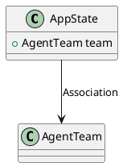
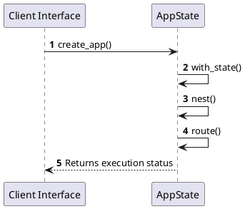

# Module Specification: Routes

* **Source Reference:** `src/interface/http/routes.rs`
* **Package Dependency:**
- `use axum::{
    routing::{get, post},
    Router,
};`
- `use crate::domain::agent::team::AgentTeam;`
- `use crate::interface::http::handlers::{docs_redirect, get_models, route_query};`
- `use crate::interface::http::middleware::{cors_layer, security_headers};`
- `use std::sync::Arc;`
- `use tower_http::trace::TraceLayer;`

## 1. Executive Summary & Purpose
Deterministic technical architecture for the `Routes` module extracted directly from the codebase.

## 2. UML 2.0 Diagrams
### Class & Inheritance Architecture

### Execution Flow & Runtime Behavior

## 3. Data Structures, Structs & Class Properties

### AppState
| Property | Type | Description |
| :--- | :--- | :--- |
| `team` | `AgentTeam` | Field of AppState |

## 4. Comprehensive Methods & Functions Breakdown

### `create_app`
* **Visibility:** +
* **Source Line Citation:** `src/interface/http/routes.rs:L15`

#### Input Parameters
| Parameter | Data Type | Required / Default | Semantic Description |
| :--- | :--- | :--- | :--- |
| `state` | `Arc<AppState>` | Required | Parameter |

#### Return Value & Output Shape
| Return Type | Scenario | Description |
| :--- | :--- | :--- |
| `Router` | Success | Result of the operation |

## 5. Source Code Citations & Index
* Class `AppState`: `src/interface/http/routes.rs:L11`
* Method `create_app`: `src/interface/http/routes.rs:L15`
