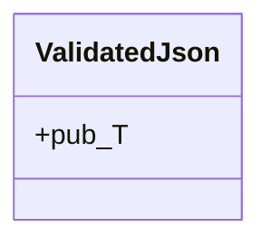
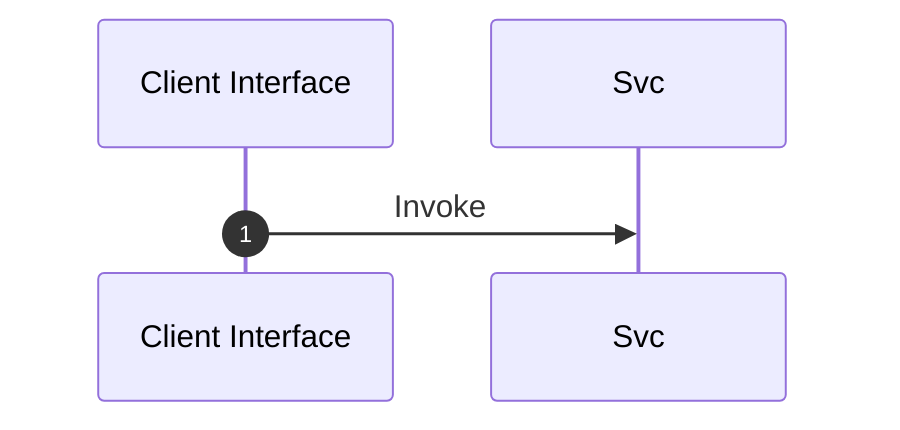

# Module Specification: Validation

* **Source Reference:** `src/interface/http/validation.rs`
* **Package Dependency:**
- `axum::{`
- `serde::de::DeserializeOwned`

## 1. Executive Summary & Purpose
Deterministic technical architecture for the `Validation` module extracted directly from the codebase.

## 2. UML 2.0 Diagrams
### Class & Inheritance Architecture

### Execution Flow & Runtime Behavior

## 3. Data Structures, Structs & Class Properties

### ValidatedJson
| Property | Type | Description |
| :--- | :--- | :--- |
| `N/A` | `pub T` | Field of ValidatedJson |

## 4. Comprehensive Methods & Functions Breakdown

No methods or functions defined in this module.

## 5. Source Code Citations & Index
* Class `ValidatedJson`: `src/interface/http/validation.rs:L10`
