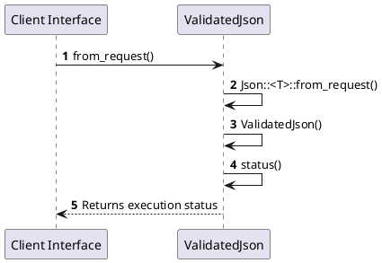

# Module Specification: Validation

* **Source Reference:** `src/interface/http/validation.rs`
* **Package Dependency:**
- `use axum::{
    async_trait,
    extract::{FromRequest, Request},
    http::StatusCode,
    response::{IntoResponse, Response},
    Json,
};`
- `use serde::de::DeserializeOwned;`

## 1. Executive Summary & Purpose
Deterministic technical architecture for the `Validation` module extracted directly from the codebase.

## 2. UML 2.0 Diagrams
### Class & Inheritance Architecture
```plantuml
@startuml
    class ValidatedJson {
    }
    class ValidatedJson<T> {
        -from_request()
    }
    FromRequest<S> <|.. ValidatedJson<T> : Realization
@enduml
```


### Execution Flow & Runtime Behavior



## 3. Data Structures, Structs & Class Properties

No notable data structures or fields in this module.


## 4. Comprehensive Methods & Functions Breakdown

### `ValidatedJson<T>::from_request`
* **Visibility:** -
* **Source Line Citation:** `src/interface/http/validation.rs:L20`

#### Input Parameters
| Parameter | Data Type | Required / Default | Semantic Description |
| :--- | :--- | :--- | :--- |
| `req` | `Request` | Required | Parameter |
| `state` | `&S` | Required | Parameter |

#### Return Value & Output Shape
| Return Type | Scenario | Description |
| :--- | :--- | :--- |
| `Result<Self, Self::Rejection>` | Success | Result of the operation |


## 5. Source Code Citations & Index
* Class `ValidatedJson`: `src/interface/http/validation.rs:L10`
* Class `ValidatedJson<T>`: `src/interface/http/validation.rs:L13`
* Method `from_request` in `ValidatedJson<T>`: `src/interface/http/validation.rs:L20`
