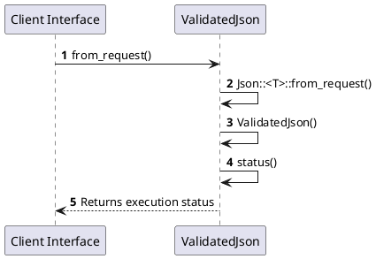

# Module Specification: Validation

* **Source Reference:** `src/interface/http/validation.rs`
* **Package Dependency:**
- `use axum::{
    async_trait,
    extract::{FromRequest, Request},
    http::StatusCode,
    response::{IntoResponse, Response},
    Json,
};`
- `use serde::de::DeserializeOwned;`

## 1. Executive Summary & Purpose
Deterministic technical architecture for the `Validation` module extracted directly from the codebase.

## 2. UML 2.0 Diagrams
### Class & Inheritance Architecture
```plantuml
@startuml
    class ValidatedJson {
        +T
        -from_request()
    }
    FromRequest<S> <|.. ValidatedJson : Realization
    ValidatedJson --> "T" : Association
@enduml
```

### Execution Flow & Runtime Behavior

```plantuml
@startuml
    autonumber
    participant "Client Interface" as Caller
    participant ValidatedJson as Svc
    Caller->Svc: from_request()
    Svc->Svc: Json::<T>::from_request()
    Svc->Svc: ValidatedJson()
    Svc->Svc: status()
    Svc-->Caller: Returns execution status
@enduml
```

## 3. Data Structures, Structs & Class Properties

### ValidatedJson
| Property | Type | Description |
| :--- | :--- | :--- |
| `N/A` | `T` | Field of ValidatedJson |

## 4. Comprehensive Methods & Functions Breakdown

### `ValidatedJson::from_request`
* **Visibility:** -
* **Source Line Citation:** `src/interface/http/validation.rs:L20`

**Purpose:** No description provided.

#### Parameters
| Parameter | Type | Description |
| :--- | :--- | :--- |
| `req` | `Request` | Parameter |
| `state` | `&S` | Parameter |

#### Return value
`Result<Self, Self::Rejection>`

## 5. Source Code Citations & Index
* Class `ValidatedJson`: `src/interface/http/validation.rs:L10`
* Method `from_request` in `ValidatedJson`: `src/interface/http/validation.rs:L20`
