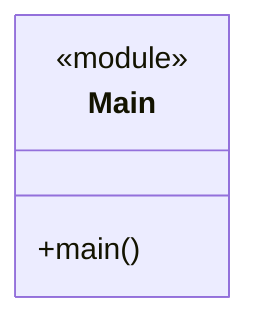
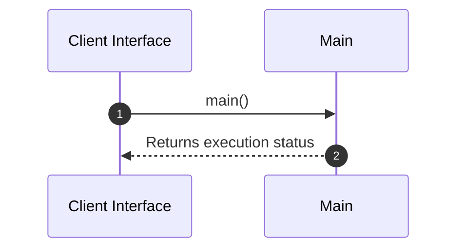

# Module Specification: Main

* **Source Reference:** `src/main.rs`
* **Package Dependency:**
- `dotenvy::dotenv`
- `rust_agent_team::domain::agent::team::AgentTeam`
- `rust_agent_team::infrastructure::telemetry`
- `rust_agent_team::{create_app, AppState}`
- `std::env`
- `std::sync::Arc`

## 1. Executive Summary & Purpose
Deterministic technical architecture for the `Main` module extracted directly from the codebase.

## 2. UML 2.0 Diagrams
### Class & Inheritance Architecture

### Execution Flow & Runtime Behavior

## 3. Data Structures, Structs & Class Properties

No notable data structures or fields in this module.

## 4. Comprehensive Methods & Functions Breakdown

### `main`
* **Visibility:** +
* **Source Line Citation:** `src/main.rs:L9`

#### Input Parameters
| Parameter | Data Type | Required / Default | Semantic Description |
| :--- | :--- | :--- | :--- |
| None | None | N/A | No parameters |

#### Return Value & Output Shape
| Return Type | Scenario | Description |
| :--- | :--- | :--- |
| `anyhow::Result<()>` | Success | Result of the operation |

## 5. Source Code Citations & Index
* Class `Main`: `src/main.rs:L1`
* Method `main`: `src/main.rs:L9`
