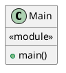
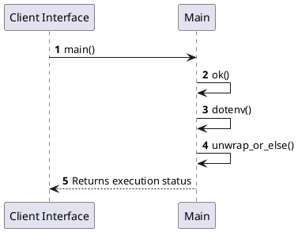

# Module Specification: Main

* **Source Reference:** `src/main.rs`
* **Package Dependency:**
- `use dotenvy::dotenv;`
- `use rust_agent_team::domain::agent::team::AgentTeam;`
- `use rust_agent_team::infrastructure::telemetry;`
- `use rust_agent_team::{create_app, AppState};`
- `use std::env;`
- `use std::sync::Arc;`

## 1. Executive Summary & Purpose
Deterministic technical architecture for the `Main` module extracted directly from the codebase.

## 2. UML 2.0 Diagrams
### Class & Inheritance Architecture

```plantuml
@startuml
    class Main {
        <<module>>
        +main()
    }
@enduml
```

### Execution Flow & Runtime Behavior

```plantuml
@startuml
    autonumber
    participant "Client Interface" as Caller
    participant Main as Svc
    Caller->Svc: main()
    Svc->Svc: ok()
    Svc->Svc: dotenv()
    Svc->Svc: unwrap_or_else()
    Svc-->Caller: Returns execution status
@enduml
```

## 3. Data Structures, Structs & Class Properties

### Main

## 4. Comprehensive Methods & Functions Breakdown

### `main`
* **Visibility:** -
* **Source Line Citation:** `src/main.rs:L9`

**Purpose:** No description provided.

#### Parameters
| Parameter | Type | Description |
| :--- | :--- | :--- |
| None | None | No parameters |

#### Return value
`anyhow::Result<()>`

## 5. Source Code Citations & Index
* Class `Main`: `src/main.rs:L1`
* Method `main`: `src/main.rs:L9`
