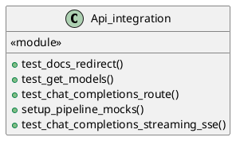
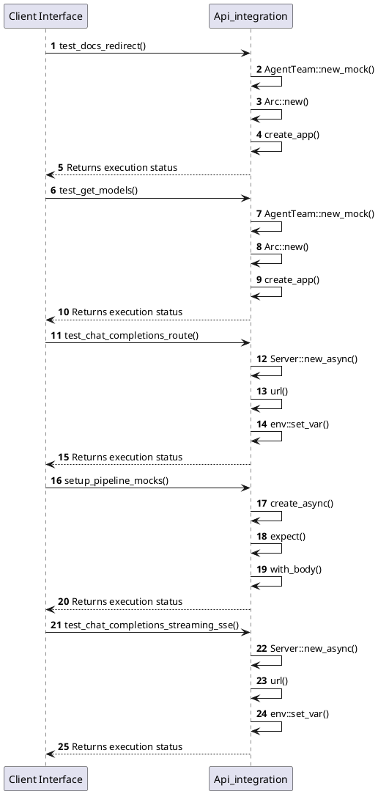

# Module Specification: Api_integration

* **Source Reference:** `tests/integration/api/api_integration.rs`
* **Package Dependency:**
- `use axum::{
    body::Body,
    http::{self, Request, StatusCode},
};`
- `use http_body_util::BodyExt;`
- `use mockito::Server;`
- `use rust_agent_team::application::dtos::{ContentType, Input, Message};`
- `use rust_agent_team::domain::agent::team::AgentTeam;`
- `use rust_agent_team::{create_app, AppState};`
- `use serde_json::Value;`
- `use std::env;`
- `use std::sync::Arc;`
- `use tower::ServiceExt;`

## 1. Executive Summary & Purpose
Deterministic technical architecture for the `Api_integration` module extracted directly from the codebase.

## 2. UML 2.0 Diagrams
### Class & Inheritance Architecture

### Execution Flow & Runtime Behavior

## 3. Data Structures, Structs & Class Properties

### Api_integration

## 4. Comprehensive Methods & Functions Breakdown

### `test_docs_redirect`
* **Visibility:** -
* **Source Line Citation:** `tests/integration/api/api_integration.rs:L16`

#### Input Parameters
| Parameter | Data Type | Required / Default | Semantic Description |
| :--- | :--- | :--- | :--- |
| None | None | N/A | No parameters |

#### Return Value & Output Shape
| Return Type | Scenario | Description |
| :--- | :--- | :--- |
| `()` | Success | Result of the operation |

### `test_get_models`
* **Visibility:** -
* **Source Line Citation:** `tests/integration/api/api_integration.rs:L39`

#### Input Parameters
| Parameter | Data Type | Required / Default | Semantic Description |
| :--- | :--- | :--- | :--- |
| None | None | N/A | No parameters |

#### Return Value & Output Shape
| Return Type | Scenario | Description |
| :--- | :--- | :--- |
| `()` | Success | Result of the operation |

### `test_chat_completions_route`
* **Visibility:** -
* **Source Line Citation:** `tests/integration/api/api_integration.rs:L64`

#### Input Parameters
| Parameter | Data Type | Required / Default | Semantic Description |
| :--- | :--- | :--- | :--- |
| None | None | N/A | No parameters |

#### Return Value & Output Shape
| Return Type | Scenario | Description |
| :--- | :--- | :--- |
| `()` | Success | Result of the operation |

### `setup_pipeline_mocks`
* **Visibility:** -
* **Source Line Citation:** `tests/integration/api/api_integration.rs:L223`

**Description:** Builds the full set of mockito mocks for the three-agent pipeline.

#### Input Parameters
| Parameter | Data Type | Required / Default | Semantic Description |
| :--- | :--- | :--- | :--- |
| `server` | `&mut Server` | Required | Parameter |

#### Return Value & Output Shape
| Return Type | Scenario | Description |
| :--- | :--- | :--- |
| `Vec<mockito::Mock>` | Success | Result of the operation |

### `test_chat_completions_streaming_sse`
* **Visibility:** -
* **Source Line Citation:** `tests/integration/api/api_integration.rs:L315`

#### Input Parameters
| Parameter | Data Type | Required / Default | Semantic Description |
| :--- | :--- | :--- | :--- |
| None | None | N/A | No parameters |

#### Return Value & Output Shape
| Return Type | Scenario | Description |
| :--- | :--- | :--- |
| `()` | Success | Result of the operation |

## 5. Source Code Citations & Index
* Class `Api_integration`: `tests/integration/api/api_integration.rs:L1`
* Method `test_docs_redirect`: `tests/integration/api/api_integration.rs:L16`
* Method `test_get_models`: `tests/integration/api/api_integration.rs:L39`
* Method `test_chat_completions_route`: `tests/integration/api/api_integration.rs:L64`
* Method `setup_pipeline_mocks`: `tests/integration/api/api_integration.rs:L223`
* Method `test_chat_completions_streaming_sse`: `tests/integration/api/api_integration.rs:L315`
