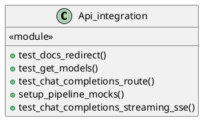
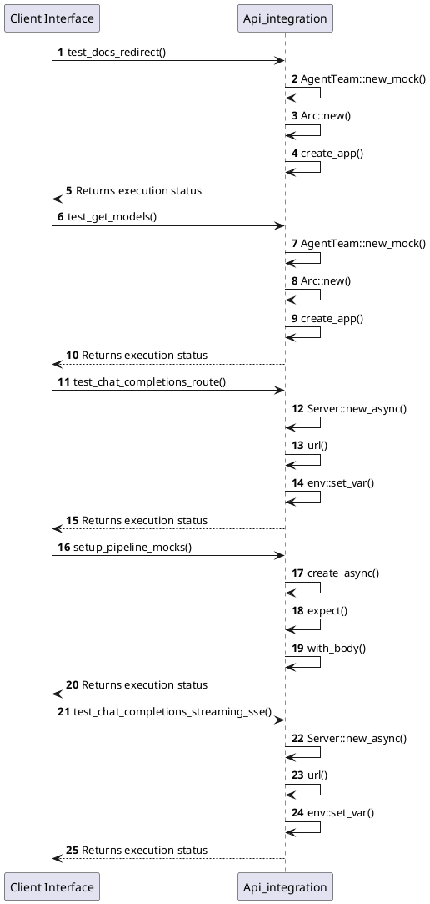

# Module Specification: Api_integration

* **Source Reference:** `tests/integration/api/api_integration.rs`
* **Package Dependency:**
- `use axum::{
    body::Body,
    http::{self, Request, StatusCode},
};`
- `use http_body_util::BodyExt;`
- `use mockito::Server;`
- `use rust_agent_team::application::dtos::{ContentType, Input, Message};`
- `use rust_agent_team::domain::agent::team::AgentTeam;`
- `use rust_agent_team::{create_app, AppState};`
- `use serde_json::Value;`
- `use std::env;`
- `use std::sync::Arc;`
- `use tower::ServiceExt;`

## 1. Executive Summary & Purpose
Deterministic technical architecture for the `Api_integration` module extracted directly from the codebase.

## 2. UML 2.0 Diagrams
### Class & Inheritance Architecture

```plantuml
@startuml
    class Api_integration {
        <<module>>
        +test_docs_redirect()
        +test_get_models()
        +test_chat_completions_route()
        +setup_pipeline_mocks()
        +test_chat_completions_streaming_sse()
    }
@enduml
```

### Execution Flow & Runtime Behavior

```plantuml
@startuml
    autonumber
    participant "Client Interface" as Caller
    participant Api_integration as Svc
    Caller->Svc: test_docs_redirect()
    Svc->Svc: AgentTeam::new_mock()
    Svc->Svc: Arc::new()
    Svc->Svc: create_app()
    Svc-->Caller: Returns execution status
    Caller->Svc: test_get_models()
    Svc->Svc: AgentTeam::new_mock()
    Svc->Svc: Arc::new()
    Svc->Svc: create_app()
    Svc-->Caller: Returns execution status
    Caller->Svc: test_chat_completions_route()
    Svc->Svc: Server::new_async()
    Svc->Svc: url()
    Svc->Svc: env::set_var()
    Svc-->Caller: Returns execution status
    Caller->Svc: setup_pipeline_mocks()
    Svc->Svc: create_async()
    Svc->Svc: expect()
    Svc->Svc: with_body()
    Svc-->Caller: Returns execution status
    Caller->Svc: test_chat_completions_streaming_sse()
    Svc->Svc: Server::new_async()
    Svc->Svc: url()
    Svc->Svc: env::set_var()
    Svc-->Caller: Returns execution status
@enduml
```

## 3. Data Structures, Structs & Class Properties

### Api_integration

## 4. Comprehensive Methods & Functions Breakdown

### `test_docs_redirect`
* **Visibility:** -
* **Source Line Citation:** `tests/integration/api/api_integration.rs:L16`

**Purpose:** No description provided.

#### Parameters
| Parameter | Type | Description |
| :--- | :--- | :--- |
| None | None | No parameters |

#### Return value
`()`

### `test_get_models`
* **Visibility:** -
* **Source Line Citation:** `tests/integration/api/api_integration.rs:L39`

**Purpose:** No description provided.

#### Parameters
| Parameter | Type | Description |
| :--- | :--- | :--- |
| None | None | No parameters |

#### Return value
`()`

### `test_chat_completions_route`
* **Visibility:** -
* **Source Line Citation:** `tests/integration/api/api_integration.rs:L64`

**Purpose:** No description provided.

#### Parameters
| Parameter | Type | Description |
| :--- | :--- | :--- |
| None | None | No parameters |

#### Return value
`()`

### `setup_pipeline_mocks`
* **Visibility:** -
* **Source Line Citation:** `tests/integration/api/api_integration.rs:L223`

**Purpose:** Builds the full set of mockito mocks for the three-agent pipeline.

#### Parameters
| Parameter | Type | Description |
| :--- | :--- | :--- |
| `server` | `&mut Server` | Parameter |

#### Return value
`Vec<mockito::Mock>`

### `test_chat_completions_streaming_sse`
* **Visibility:** -
* **Source Line Citation:** `tests/integration/api/api_integration.rs:L315`

**Purpose:** No description provided.

#### Parameters
| Parameter | Type | Description |
| :--- | :--- | :--- |
| None | None | No parameters |

#### Return value
`()`

## 5. Source Code Citations & Index
* Class `Api_integration`: `tests/integration/api/api_integration.rs:L1`
* Method `test_docs_redirect`: `tests/integration/api/api_integration.rs:L16`
* Method `test_get_models`: `tests/integration/api/api_integration.rs:L39`
* Method `test_chat_completions_route`: `tests/integration/api/api_integration.rs:L64`
* Method `setup_pipeline_mocks`: `tests/integration/api/api_integration.rs:L223`
* Method `test_chat_completions_streaming_sse`: `tests/integration/api/api_integration.rs:L315`
