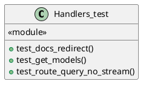
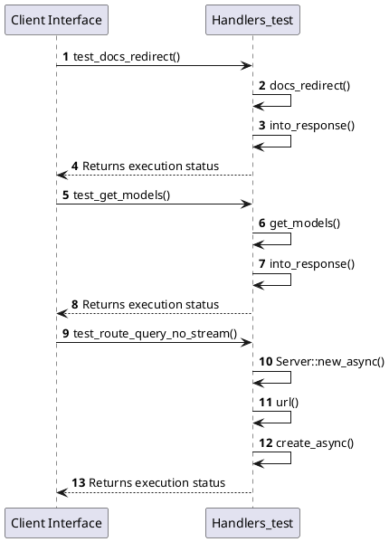

# Module Specification: Handlers_test

* **Source Reference:** `tests/integration/api/handlers_test.rs`
* **Package Dependency:**
- `use axum::{
    extract::State,
    http::{HeaderMap, StatusCode},
    response::IntoResponse,
};`
- `use mockito::Server;`
- `use rust_agent_team::application::dtos::{ContentType, Input, Message};`
- `use rust_agent_team::domain::agent::team::AgentTeam;`
- `use rust_agent_team::interface::http::handlers::{docs_redirect, get_models, route_query};`
- `use rust_agent_team::interface::http::routes::AppState;`
- `use rust_agent_team::interface::http::validation::ValidatedJson;`
- `use std::sync::Arc;`

## 1. Executive Summary & Purpose
Deterministic technical architecture for the `Handlers_test` module extracted directly from the codebase.

## 2. UML 2.0 Diagrams
### Class & Inheritance Architecture

### Execution Flow & Runtime Behavior

## 3. Data Structures, Structs & Class Properties

### Handlers_test

## 4. Comprehensive Methods & Functions Breakdown

### `test_docs_redirect`
* **Visibility:** -
* **Source Line Citation:** `tests/integration/api/handlers_test.rs:L15`

#### Input Parameters
| Parameter | Data Type | Required / Default | Semantic Description |
| :--- | :--- | :--- | :--- |
| None | None | N/A | No parameters |

#### Return Value & Output Shape
| Return Type | Scenario | Description |
| :--- | :--- | :--- |
| `()` | Success | Result of the operation |

### `test_get_models`
* **Visibility:** -
* **Source Line Citation:** `tests/integration/api/handlers_test.rs:L26`

#### Input Parameters
| Parameter | Data Type | Required / Default | Semantic Description |
| :--- | :--- | :--- | :--- |
| None | None | N/A | No parameters |

#### Return Value & Output Shape
| Return Type | Scenario | Description |
| :--- | :--- | :--- |
| `()` | Success | Result of the operation |

### `test_route_query_no_stream`
* **Visibility:** -
* **Source Line Citation:** `tests/integration/api/handlers_test.rs:L33`

#### Input Parameters
| Parameter | Data Type | Required / Default | Semantic Description |
| :--- | :--- | :--- | :--- |
| None | None | N/A | No parameters |

#### Return Value & Output Shape
| Return Type | Scenario | Description |
| :--- | :--- | :--- |
| `()` | Success | Result of the operation |

## 5. Source Code Citations & Index
* Class `Handlers_test`: `tests/integration/api/handlers_test.rs:L1`
* Method `test_docs_redirect`: `tests/integration/api/handlers_test.rs:L15`
* Method `test_get_models`: `tests/integration/api/handlers_test.rs:L26`
* Method `test_route_query_no_stream`: `tests/integration/api/handlers_test.rs:L33`
