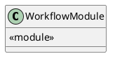
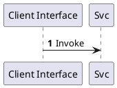

# Module Specification: WorkflowModule

* **Source Reference:** `tests/integration/workflow/mod.rs`
* **Package Dependency:**
- None

## 1. Executive Summary & Purpose
Deterministic technical architecture for the `WorkflowModule` module extracted directly from the codebase.

## 2. UML 2.0 Diagrams
### Class & Inheritance Architecture

### Execution Flow & Runtime Behavior

## 3. Data Structures, Structs & Class Properties

### WorkflowModule

## 4. Comprehensive Methods & Functions Breakdown

No methods or functions defined in this module.

## 5. Source Code Citations & Index
* Class `WorkflowModule`: `tests/integration/workflow/mod.rs:L1`
