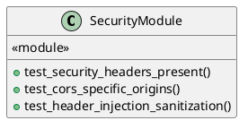
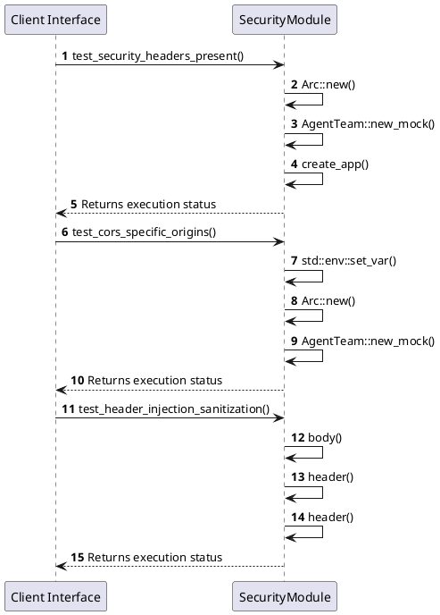

# Module Specification: SecurityModule

* **Source Reference:** `tests/security/mod.rs`
* **Package Dependency:**
- `use axum::{
    body::Body,
    http::{Request, StatusCode},
};`
- `use rust_agent_team::domain::agent::team::AgentTeam;`
- `use rust_agent_team::{create_app, AppState};`
- `use serde_json::json;`
- `use std::sync::Arc;`
- `use tower::ServiceExt;`

## 1. Executive Summary & Purpose
Deterministic technical architecture for the `SecurityModule` module extracted directly from the codebase.

## 2. UML 2.0 Diagrams
### Class & Inheritance Architecture

### Execution Flow & Runtime Behavior

## 3. Data Structures, Structs & Class Properties

### SecurityModule

## 4. Comprehensive Methods & Functions Breakdown

### `test_security_headers_present`
* **Visibility:** -
* **Source Line Citation:** `tests/security/mod.rs:L12`

#### Input Parameters
| Parameter | Data Type | Required / Default | Semantic Description |
| :--- | :--- | :--- | :--- |
| None | None | N/A | No parameters |

#### Return Value & Output Shape
| Return Type | Scenario | Description |
| :--- | :--- | :--- |
| `()` | Success | Result of the operation |

### `test_cors_specific_origins`
* **Visibility:** -
* **Source Line Citation:** `tests/security/mod.rs:L47`

#### Input Parameters
| Parameter | Data Type | Required / Default | Semantic Description |
| :--- | :--- | :--- | :--- |
| None | None | N/A | No parameters |

#### Return Value & Output Shape
| Return Type | Scenario | Description |
| :--- | :--- | :--- |
| `()` | Success | Result of the operation |

### `test_header_injection_sanitization`
* **Visibility:** -
* **Source Line Citation:** `tests/security/mod.rs:L100`

#### Input Parameters
| Parameter | Data Type | Required / Default | Semantic Description |
| :--- | :--- | :--- | :--- |
| None | None | N/A | No parameters |

#### Return Value & Output Shape
| Return Type | Scenario | Description |
| :--- | :--- | :--- |
| `()` | Success | Result of the operation |

## 5. Source Code Citations & Index
* Class `SecurityModule`: `tests/security/mod.rs:L1`
* Method `test_security_headers_present`: `tests/security/mod.rs:L12`
* Method `test_cors_specific_origins`: `tests/security/mod.rs:L47`
* Method `test_header_injection_sanitization`: `tests/security/mod.rs:L100`
