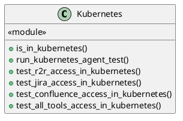
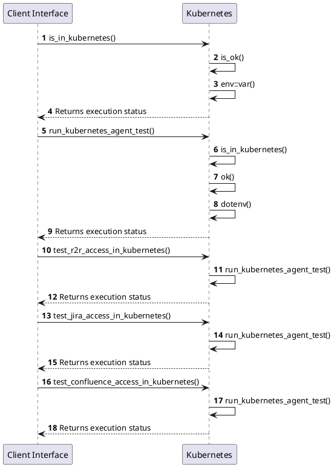

# Module Specification: Kubernetes

* **Source Reference:** `tests/smoke/kubernetes.rs`
* **Package Dependency:**
- `use dotenvy::dotenv;`
- `use futures::StreamExt;`
- `use rust_agent_team::application::dtos::{ContentType, Input, Message};`
- `use rust_agent_team::domain::agent::team::{AgentEvent, AgentTeam};`
- `use std::env;`

## 1. Executive Summary & Purpose
Deterministic technical architecture for the `Kubernetes` module extracted directly from the codebase.

## 2. UML 2.0 Diagrams
### Class & Inheritance Architecture

### Execution Flow & Runtime Behavior

## 3. Data Structures, Structs & Class Properties

### Kubernetes

## 4. Comprehensive Methods & Functions Breakdown

### `is_in_kubernetes`
* **Visibility:** -
* **Source Line Citation:** `tests/smoke/kubernetes.rs:L8`

**Description:** Helper function to determine if the test is running inside a Kubernetes cluster.

#### Input Parameters
| Parameter | Data Type | Required / Default | Semantic Description |
| :--- | :--- | :--- | :--- |
| None | None | N/A | No parameters |

#### Return Value & Output Shape
| Return Type | Scenario | Description |
| :--- | :--- | :--- |
| `bool` | Success | Result of the operation |

### `run_kubernetes_agent_test`
* **Visibility:** -
* **Source Line Citation:** `tests/smoke/kubernetes.rs:L13`

**Description:** Helper function to run the agent team with a specific prompt and check if a specific tool was triggered.

#### Input Parameters
| Parameter | Data Type | Required / Default | Semantic Description |
| :--- | :--- | :--- | :--- |
| `prompt` | `&str` | Required | Parameter |
| `expected_tool_indicator` | `&str` | Required | Parameter |

#### Return Value & Output Shape
| Return Type | Scenario | Description |
| :--- | :--- | :--- |
| `()` | Success | Result of the operation |

### `test_r2r_access_in_kubernetes`
* **Visibility:** -
* **Source Line Citation:** `tests/smoke/kubernetes.rs:L106`

**Description:** PRODUCTION TEST: Verify that the agent successfully accesses R2R (RAG) information inside Kubernetes.

#### Input Parameters
| Parameter | Data Type | Required / Default | Semantic Description |
| :--- | :--- | :--- | :--- |
| None | None | N/A | No parameters |

#### Return Value & Output Shape
| Return Type | Scenario | Description |
| :--- | :--- | :--- |
| `()` | Success | Result of the operation |

### `test_jira_access_in_kubernetes`
* **Visibility:** -
* **Source Line Citation:** `tests/smoke/kubernetes.rs:L117`

**Description:** PRODUCTION TEST: Verify that the agent successfully accesses JIRA information inside Kubernetes.

#### Input Parameters
| Parameter | Data Type | Required / Default | Semantic Description |
| :--- | :--- | :--- | :--- |
| None | None | N/A | No parameters |

#### Return Value & Output Shape
| Return Type | Scenario | Description |
| :--- | :--- | :--- |
| `()` | Success | Result of the operation |

### `test_confluence_access_in_kubernetes`
* **Visibility:** -
* **Source Line Citation:** `tests/smoke/kubernetes.rs:L128`

**Description:** PRODUCTION TEST: Verify that the agent successfully accesses Confluence information inside Kubernetes.

#### Input Parameters
| Parameter | Data Type | Required / Default | Semantic Description |
| :--- | :--- | :--- | :--- |
| None | None | N/A | No parameters |

#### Return Value & Output Shape
| Return Type | Scenario | Description |
| :--- | :--- | :--- |
| `()` | Success | Result of the operation |

### `test_all_tools_access_in_kubernetes`
* **Visibility:** -
* **Source Line Citation:** `tests/smoke/kubernetes.rs:L139`

**Description:** PRODUCTION TEST: Verify that the agent successfully accesses ALL three systems in a single prompt.

#### Input Parameters
| Parameter | Data Type | Required / Default | Semantic Description |
| :--- | :--- | :--- | :--- |
| None | None | N/A | No parameters |

#### Return Value & Output Shape
| Return Type | Scenario | Description |
| :--- | :--- | :--- |
| `()` | Success | Result of the operation |

## 5. Source Code Citations & Index
* Class `Kubernetes`: `tests/smoke/kubernetes.rs:L1`
* Method `is_in_kubernetes`: `tests/smoke/kubernetes.rs:L8`
* Method `run_kubernetes_agent_test`: `tests/smoke/kubernetes.rs:L13`
* Method `test_r2r_access_in_kubernetes`: `tests/smoke/kubernetes.rs:L106`
* Method `test_jira_access_in_kubernetes`: `tests/smoke/kubernetes.rs:L117`
* Method `test_confluence_access_in_kubernetes`: `tests/smoke/kubernetes.rs:L128`
* Method `test_all_tools_access_in_kubernetes`: `tests/smoke/kubernetes.rs:L139`
