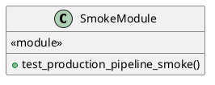
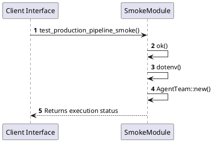

# Module Specification: SmokeModule

* **Source Reference:** `tests/smoke/mod.rs`
* **Package Dependency:**
- `use axum::{
    body::Body,
    http::{self, Request, StatusCode},
};`
- `use dotenvy::dotenv;`
- `use http_body_util::BodyExt;`
- `use rust_agent_team::application::dtos::{ContentType, Input, Message};`
- `use rust_agent_team::domain::agent::team::AgentTeam;`
- `use rust_agent_team::{create_app, AppState};`
- `use std::sync::Arc;`
- `use tower::ServiceExt;`

## 1. Executive Summary & Purpose
Deterministic technical architecture for the `SmokeModule` module extracted directly from the codebase.

## 2. UML 2.0 Diagrams
### Class & Inheritance Architecture

### Execution Flow & Runtime Behavior

## 3. Data Structures, Structs & Class Properties

### SmokeModule

## 4. Comprehensive Methods & Functions Breakdown

### `test_production_pipeline_smoke`
* **Visibility:** -
* **Source Line Citation:** `tests/smoke/mod.rs:L23`

**Description:** PRODUCTION SMOKE TEST
This test verifies that the system can connect to:
1. LiteLLM (OpenAI Compatible)
2. Jira
3. R2R (RAG)

CAUTION: This test consumes real LLM tokens and makes live requests.
It is ignored by default. Run with `cargo test --test smoke_tests -- --ignored`.

#### Input Parameters
| Parameter | Data Type | Required / Default | Semantic Description |
| :--- | :--- | :--- | :--- |
| None | None | N/A | No parameters |

#### Return Value & Output Shape
| Return Type | Scenario | Description |
| :--- | :--- | :--- |
| `()` | Success | Result of the operation |

## 5. Source Code Citations & Index
* Class `SmokeModule`: `tests/smoke/mod.rs:L1`
* Method `test_production_pipeline_smoke`: `tests/smoke/mod.rs:L23`
