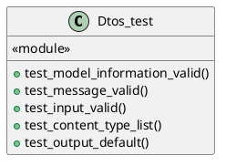
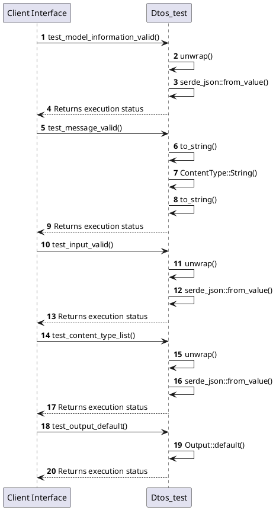

# Module Specification: Dtos_test

* **Source Reference:** `tests/unit/application/dtos_test.rs`
* **Package Dependency:**
- `use rust_agent_team::application::dtos::*;`
- `use serde_json::json;`

## 1. Executive Summary & Purpose
Deterministic technical architecture for the `Dtos_test` module extracted directly from the codebase.

## 2. UML 2.0 Diagrams
### Class & Inheritance Architecture

### Execution Flow & Runtime Behavior

## 3. Data Structures, Structs & Class Properties

### Dtos_test

## 4. Comprehensive Methods & Functions Breakdown

### `test_model_information_valid`
* **Visibility:** -
* **Source Line Citation:** `tests/unit/application/dtos_test.rs:L5`

#### Input Parameters
| Parameter | Data Type | Required / Default | Semantic Description |
| :--- | :--- | :--- | :--- |
| None | None | N/A | No parameters |

#### Return Value & Output Shape
| Return Type | Scenario | Description |
| :--- | :--- | :--- |
| `()` | Success | Result of the operation |

### `test_message_valid`
* **Visibility:** -
* **Source Line Citation:** `tests/unit/application/dtos_test.rs:L23`

#### Input Parameters
| Parameter | Data Type | Required / Default | Semantic Description |
| :--- | :--- | :--- | :--- |
| None | None | N/A | No parameters |

#### Return Value & Output Shape
| Return Type | Scenario | Description |
| :--- | :--- | :--- |
| `()` | Success | Result of the operation |

### `test_input_valid`
* **Visibility:** -
* **Source Line Citation:** `tests/unit/application/dtos_test.rs:L33`

#### Input Parameters
| Parameter | Data Type | Required / Default | Semantic Description |
| :--- | :--- | :--- | :--- |
| None | None | N/A | No parameters |

#### Return Value & Output Shape
| Return Type | Scenario | Description |
| :--- | :--- | :--- |
| `()` | Success | Result of the operation |

### `test_content_type_list`
* **Visibility:** -
* **Source Line Citation:** `tests/unit/application/dtos_test.rs:L45`

#### Input Parameters
| Parameter | Data Type | Required / Default | Semantic Description |
| :--- | :--- | :--- | :--- |
| None | None | N/A | No parameters |

#### Return Value & Output Shape
| Return Type | Scenario | Description |
| :--- | :--- | :--- |
| `()` | Success | Result of the operation |

### `test_output_default`
* **Visibility:** -
* **Source Line Citation:** `tests/unit/application/dtos_test.rs:L65`

#### Input Parameters
| Parameter | Data Type | Required / Default | Semantic Description |
| :--- | :--- | :--- | :--- |
| None | None | N/A | No parameters |

#### Return Value & Output Shape
| Return Type | Scenario | Description |
| :--- | :--- | :--- |
| `()` | Success | Result of the operation |

## 5. Source Code Citations & Index
* Class `Dtos_test`: `tests/unit/application/dtos_test.rs:L1`
* Method `test_model_information_valid`: `tests/unit/application/dtos_test.rs:L5`
* Method `test_message_valid`: `tests/unit/application/dtos_test.rs:L23`
* Method `test_input_valid`: `tests/unit/application/dtos_test.rs:L33`
* Method `test_content_type_list`: `tests/unit/application/dtos_test.rs:L45`
* Method `test_output_default`: `tests/unit/application/dtos_test.rs:L65`
