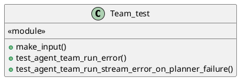
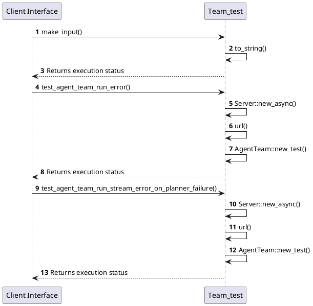

# Module Specification: Team_test

* **Source Reference:** `tests/unit/domain/team_test.rs`
* **Package Dependency:**
- `use futures::StreamExt;`
- `use mockito::Server;`
- `use rust_agent_team::application::dtos::{ContentType, Input, Message};`
- `use rust_agent_team::domain::agent::team::AgentTeam;`

## 1. Executive Summary & Purpose
Deterministic technical architecture for the `Team_test` module extracted directly from the codebase.

## 2. UML 2.0 Diagrams
### Class & Inheritance Architecture

### Execution Flow & Runtime Behavior

## 3. Data Structures, Structs & Class Properties

### Team_test

## 4. Comprehensive Methods & Functions Breakdown

### `make_input`
* **Visibility:** -
* **Source Line Citation:** `tests/unit/domain/team_test.rs:L5`

#### Input Parameters
| Parameter | Data Type | Required / Default | Semantic Description |
| :--- | :--- | :--- | :--- |
| `text` | `&str` | Required | Parameter |

#### Return Value & Output Shape
| Return Type | Scenario | Description |
| :--- | :--- | :--- |
| `Input` | Success | Result of the operation |

### `test_agent_team_run_error`
* **Visibility:** -
* **Source Line Citation:** `tests/unit/domain/team_test.rs:L23`

#### Input Parameters
| Parameter | Data Type | Required / Default | Semantic Description |
| :--- | :--- | :--- | :--- |
| None | None | N/A | No parameters |

#### Return Value & Output Shape
| Return Type | Scenario | Description |
| :--- | :--- | :--- |
| `()` | Success | Result of the operation |

### `test_agent_team_run_stream_error_on_planner_failure`
* **Visibility:** -
* **Source Line Citation:** `tests/unit/domain/team_test.rs:L39`

#### Input Parameters
| Parameter | Data Type | Required / Default | Semantic Description |
| :--- | :--- | :--- | :--- |
| None | None | N/A | No parameters |

#### Return Value & Output Shape
| Return Type | Scenario | Description |
| :--- | :--- | :--- |
| `()` | Success | Result of the operation |

## 5. Source Code Citations & Index
* Class `Team_test`: `tests/unit/domain/team_test.rs:L1`
* Method `make_input`: `tests/unit/domain/team_test.rs:L5`
* Method `test_agent_team_run_error`: `tests/unit/domain/team_test.rs:L23`
* Method `test_agent_team_run_stream_error_on_planner_failure`: `tests/unit/domain/team_test.rs:L39`
