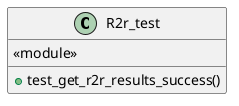
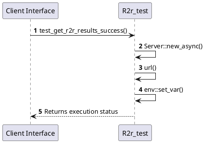

# Module Specification: R2r_test

* **Source Reference:** `tests/unit/infrastructure/r2r_test.rs`
* **Package Dependency:**
- `use mockito::Server;`
- `use rust_agent_team::infrastructure::tools::r2r::get_r2r_results;`
- `use std::env;`

## 1. Executive Summary & Purpose
Deterministic technical architecture for the `R2r_test` module extracted directly from the codebase.

## 2. UML 2.0 Diagrams
### Class & Inheritance Architecture

### Execution Flow & Runtime Behavior

## 3. Data Structures, Structs & Class Properties

### R2r_test

## 4. Comprehensive Methods & Functions Breakdown

### `test_get_r2r_results_success`
* **Visibility:** -
* **Source Line Citation:** `tests/unit/infrastructure/r2r_test.rs:L6`

#### Input Parameters
| Parameter | Data Type | Required / Default | Semantic Description |
| :--- | :--- | :--- | :--- |
| None | None | N/A | No parameters |

#### Return Value & Output Shape
| Return Type | Scenario | Description |
| :--- | :--- | :--- |
| `()` | Success | Result of the operation |

## 5. Source Code Citations & Index
* Class `R2r_test`: `tests/unit/infrastructure/r2r_test.rs:L1`
* Method `test_get_r2r_results_success`: `tests/unit/infrastructure/r2r_test.rs:L6`
