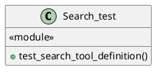
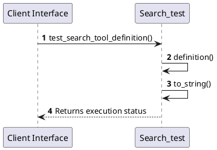

# Module Specification: Search_test

* **Source Reference:** `tests/unit/infrastructure/search_test.rs`
* **Package Dependency:**
- `use rig::tool::Tool;`
- `use rust_agent_team::infrastructure::tools::search::SearchTool;`

## 1. Executive Summary & Purpose
Deterministic technical architecture for the `Search_test` module extracted directly from the codebase.

## 2. UML 2.0 Diagrams
### Class & Inheritance Architecture

```plantuml
@startuml
    class Search_test {
        <<module>>
        +test_search_tool_definition()
    }
@enduml
```

### Execution Flow & Runtime Behavior

```plantuml
@startuml
    autonumber
    participant "Client Interface" as Caller
    participant Search_test as Svc
    Caller->Svc: test_search_tool_definition()
    Svc->Svc: definition()
    Svc->Svc: to_string()
    Svc-->Caller: Returns execution status
@enduml
```

## 3. Data Structures, Structs & Class Properties

### Search_test

## 4. Comprehensive Methods & Functions Breakdown

### `test_search_tool_definition`
* **Visibility:** -
* **Source Line Citation:** `tests/unit/infrastructure/search_test.rs:L5`

**Purpose:** No description provided.

#### Parameters
| Parameter | Type | Description |
| :--- | :--- | :--- |
| None | None | No parameters |

#### Return value
`()`

## 5. Source Code Citations & Index
* Class `Search_test`: `tests/unit/infrastructure/search_test.rs:L1`
* Method `test_search_tool_definition`: `tests/unit/infrastructure/search_test.rs:L5`
