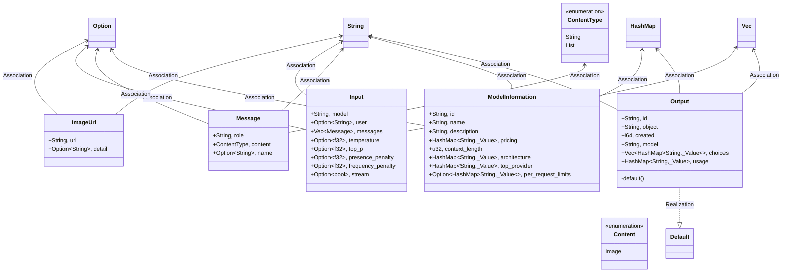
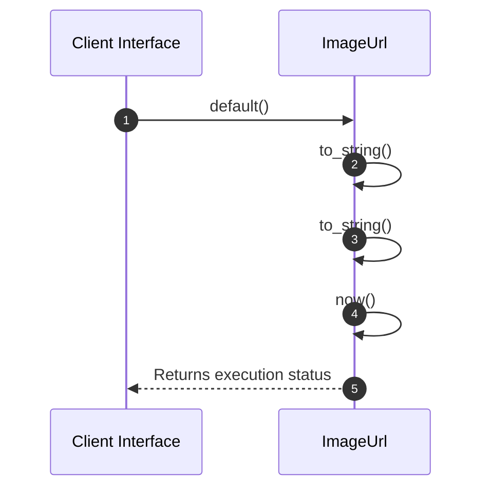

# Module Architecture: Dtos

* **Source File Reference:** `src/application/dtos.rs`
* **Package Dependencies:** Upstream: `[[{Deserialize, Serialize}]]` | `[[Value]]` | `[[HashMap]]`

## 1. Executive Summary & Purpose
Deterministic technical architecture for the `Dtos` module extracted directly from the codebase.

## 2. UML 2.0 Diagrams

### Class / Struct Architecture

### Runtime Sequence Diagram

## 3. Data Structures, Structs & Class Properties

| Property / Field | Type | Visibility | Description | Source Reference |
| :--- | :--- | :--- | :--- | :--- |
| `url` | `String,` | Public (`+`) | Extracted property url. | `src/application/dtos.rs:6` |
| `detail` | `Option<String>,` | Public (`+`) | Extracted property detail. | `src/application/dtos.rs:6` |
| `id` | `String,` | Public (`+`) | Extracted property id. | `src/application/dtos.rs:22` |
| `name` | `String,` | Public (`+`) | Extracted property name. | `src/application/dtos.rs:22` |
| `description` | `String,` | Public (`+`) | Extracted property description. | `src/application/dtos.rs:22` |
| `pricing` | `HashMap<String, Value>,` | Public (`+`) | Extracted property pricing. | `src/application/dtos.rs:22` |
| `context_length` | `u32,` | Public (`+`) | Extracted property context_length. | `src/application/dtos.rs:22` |
| `architecture` | `HashMap<String, Value>,` | Public (`+`) | Extracted property architecture. | `src/application/dtos.rs:22` |
| `top_provider` | `HashMap<String, Value>,` | Public (`+`) | Extracted property top_provider. | `src/application/dtos.rs:22` |
| `per_request_limits` | `Option<HashMap<String, Value>>,` | Public (`+`) | Extracted property per_request_limits. | `src/application/dtos.rs:22` |
| `role` | `String,` | Public (`+`) | Extracted property role. | `src/application/dtos.rs:34` |
| `content` | `ContentType,` | Public (`+`) | Extracted property content. | `src/application/dtos.rs:34` |
| `name` | `Option<String>,` | Public (`+`) | Extracted property name. | `src/application/dtos.rs:34` |
| `model` | `String,` | Public (`+`) | Extracted property model. | `src/application/dtos.rs:48` |
| `user` | `Option<String>,` | Public (`+`) | Extracted property user. | `src/application/dtos.rs:48` |
| `messages` | `Vec<Message>,` | Public (`+`) | Extracted property messages. | `src/application/dtos.rs:48` |
| `temperature` | `Option<f32>,` | Public (`+`) | Extracted property temperature. | `src/application/dtos.rs:48` |
| `top_p` | `Option<f32>,` | Public (`+`) | Extracted property top_p. | `src/application/dtos.rs:48` |
| `presence_penalty` | `Option<f32>,` | Public (`+`) | Extracted property presence_penalty. | `src/application/dtos.rs:48` |
| `frequency_penalty` | `Option<f32>,` | Public (`+`) | Extracted property frequency_penalty. | `src/application/dtos.rs:48` |
| `stream` | `Option<bool>,` | Public (`+`) | Extracted property stream. | `src/application/dtos.rs:48` |
| `id` | `String,` | Public (`+`) | Extracted property id. | `src/application/dtos.rs:61` |
| `object` | `String,` | Public (`+`) | Extracted property object. | `src/application/dtos.rs:61` |
| `created` | `i64,` | Public (`+`) | Extracted property created. | `src/application/dtos.rs:61` |
| `model` | `String,` | Public (`+`) | Extracted property model. | `src/application/dtos.rs:61` |
| `choices` | `Vec<HashMap<String, Value>>,` | Public (`+`) | Extracted property choices. | `src/application/dtos.rs:61` |
| `usage` | `HashMap<String, Value>,` | Public (`+`) | Extracted property usage. | `src/application/dtos.rs:61` |

## 4. Comprehensive Methods & Functions Breakdown

### Function / Method: `default()`
* **Source Reference:** `src/application/dtos.rs:70`
* **Visibility / Scope:** Private (`-`)
* **Behavioral Overview:** Extracted method logic.

#### Input Parameters
| Parameter | Type | Required / Default | Description |
| :--- | :--- | :--- | :--- |
| None | - | - | No parameters. |

#### Output & Return Values
| Return Type | Condition / Scenario | Description |
| :--- | :--- | :--- |
| `Self` | Standard Execution | Derived return type. |

---

## 5. Source Code Citations & Index
* Module File: `src/application/dtos.rs`
* Class `ImageUrl`: `src/application/dtos.rs:6`
* Class `ModelInformation`: `src/application/dtos.rs:22`
* Class `Message`: `src/application/dtos.rs:34`
* Class `Input`: `src/application/dtos.rs:48`
* Class `Output`: `src/application/dtos.rs:61`
* Enum `Content`: `src/application/dtos.rs:13`
* Enum `ContentType`: `src/application/dtos.rs:42`
* Method `default`: `src/application/dtos.rs:70`
