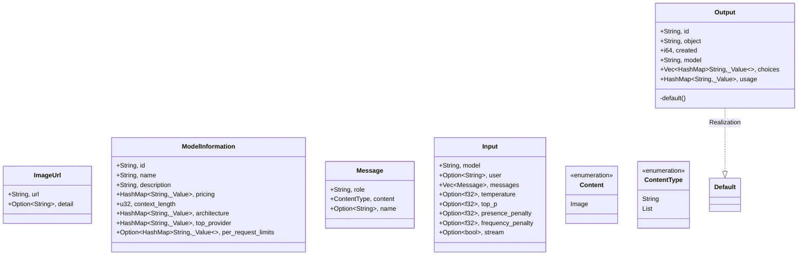
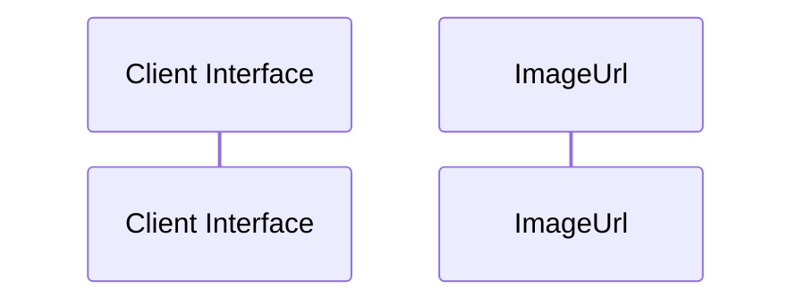

# Module Name: Dtos

* **Source Directory Reference:** `src/application/`
* **Package Dependency:**
- `serde::{Deserialize, Serialize}`
- `serde_json::Value`
- `std::collections::HashMap`

## 1. Executive Summary & Purpose
Deterministic technical architecture for the `Dtos` module extracted directly from the codebase.

## 2. UML 2.0 Class & Inheritance Architecture (Deterministic)
The following class diagram models the object-oriented structure, explicit inheritance hierarchies, and polymorphic interface implementations derived from local AST analysis:

## 3. Package & Class Relations

* **Inheritance & Polymorphism:** Diagram depicts detected traits, realizations, and abstractions.
* **Dependencies:** Defined by import structures across the boundary.

## 4. Execution Flow & Runtime Behavior

The following sequence diagram outlines the execution lifecycle and message passing during core operations:

---

* **Source Citations:**
* Class `ImageUrl`: `src/application/dtos.rs:6`
* Class `ModelInformation`: `src/application/dtos.rs:22`
* Class `Message`: `src/application/dtos.rs:34`
* Class `Input`: `src/application/dtos.rs:48`
* Class `Output`: `src/application/dtos.rs:61`
* Class `Content`: `src/application/dtos.rs:13`
* Class `ContentType`: `src/application/dtos.rs:42`
* Method `default` in `Output`: `src/application/dtos.rs:70`
