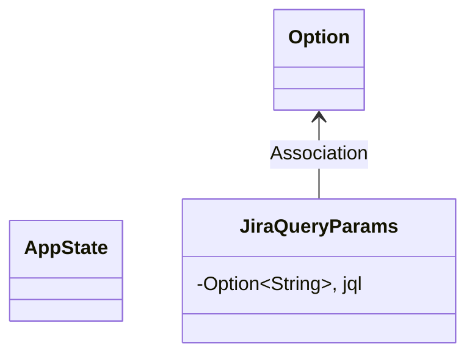
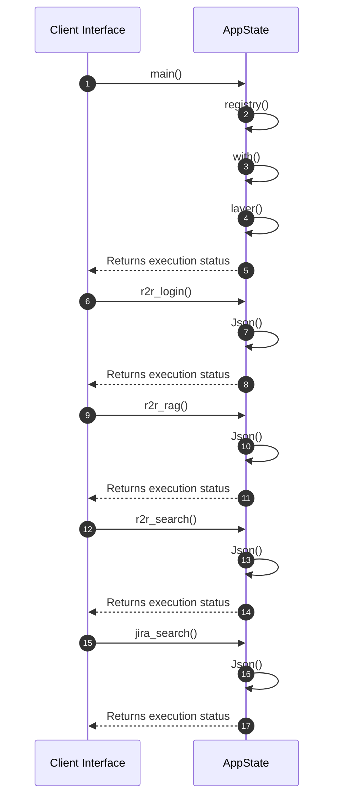

# Module Architecture: Mock_services

* **Source File Reference:** `src/bin/mock_services.rs`
* **Package Dependencies:** Upstream: `[[{]]` | `[[Deserialize]]` | `[[{json, Value}]]` | `[[SocketAddr]]` | `[[Arc]]` | `[[SubscriberInitExt}]]`

## 1. Executive Summary & Purpose
Deterministic technical architecture for the `Mock_services` module extracted directly from the codebase.

## 2. UML 2.0 Diagrams

### Class / Struct Architecture

### Runtime Sequence Diagram

## 3. Data Structures, Structs & Class Properties

| Property / Field | Type | Visibility | Description | Source Reference |
| :--- | :--- | :--- | :--- | :--- |
| `jql` | `Option<String>,` | Private (`-`) | Extracted property jql. | `src/bin/mock_services.rs:77` |

## 4. Comprehensive Methods & Functions Breakdown

### Function / Method: `main()`
* **Source Reference:** `src/bin/mock_services.rs:16`
* **Visibility / Scope:** Private (`-`)
* **Behavioral Overview:** Extracted method logic.

#### Input Parameters
| Parameter | Type | Required / Default | Description |
| :--- | :--- | :--- | :--- |
| None | - | - | No parameters. |

#### Output & Return Values
| Return Type | Condition / Scenario | Description |
| :--- | :--- | :--- |
| `void` | - | No return type extracted. |

### Function / Method: `r2r_login()`
* **Source Reference:** `src/bin/mock_services.rs:40`
* **Visibility / Scope:** Private (`-`)
* **Behavioral Overview:** Extracted method logic.

#### Input Parameters
| Parameter | Type | Required / Default | Description |
| :--- | :--- | :--- | :--- |
| None | - | - | No parameters. |

#### Output & Return Values
| Return Type | Condition / Scenario | Description |
| :--- | :--- | :--- |
| `Json<Value>` | Standard Execution | Derived return type. |

### Function / Method: `r2r_rag(Json(payload): Json<Value>)`
* **Source Reference:** `src/bin/mock_services.rs:51`
* **Visibility / Scope:** Private (`-`)
* **Behavioral Overview:** Extracted method logic.

#### Input Parameters
| Parameter | Type | Required / Default | Description |
| :--- | :--- | :--- | :--- |
| `Json(payload)` | `Json<Value>` | Required | Derived parameter. |

#### Output & Return Values
| Return Type | Condition / Scenario | Description |
| :--- | :--- | :--- |
| `Json<Value>` | Standard Execution | Derived return type. |

### Function / Method: `r2r_search(Json(payload): Json<Value>)`
* **Source Reference:** `src/bin/mock_services.rs:60`
* **Visibility / Scope:** Private (`-`)
* **Behavioral Overview:** Extracted method logic.

#### Input Parameters
| Parameter | Type | Required / Default | Description |
| :--- | :--- | :--- | :--- |
| `Json(payload)` | `Json<Value>` | Required | Derived parameter. |

#### Output & Return Values
| Return Type | Condition / Scenario | Description |
| :--- | :--- | :--- |
| `Json<Value>` | Standard Execution | Derived return type. |

### Function / Method: `jira_search(Query(params): Query<JiraQueryParams>)`
* **Source Reference:** `src/bin/mock_services.rs:81`
* **Visibility / Scope:** Private (`-`)
* **Behavioral Overview:** Extracted method logic.

#### Input Parameters
| Parameter | Type | Required / Default | Description |
| :--- | :--- | :--- | :--- |
| `Query(params)` | `Query<JiraQueryParams>` | Required | Derived parameter. |

#### Output & Return Values
| Return Type | Condition / Scenario | Description |
| :--- | :--- | :--- |
| `Json<Value>` | Standard Execution | Derived return type. |

---

## 5. Source Code Citations & Index
* Module File: `src/bin/mock_services.rs`
* Class `AppState`: `src/bin/mock_services.rs:13`
* Class `JiraQueryParams`: `src/bin/mock_services.rs:77`
* Method `main`: `src/bin/mock_services.rs:16`
* Method `r2r_login`: `src/bin/mock_services.rs:40`
* Method `r2r_rag`: `src/bin/mock_services.rs:51`
* Method `r2r_search`: `src/bin/mock_services.rs:60`
* Method `jira_search`: `src/bin/mock_services.rs:81`
