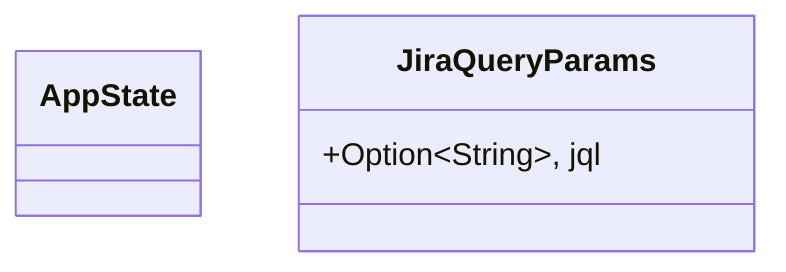
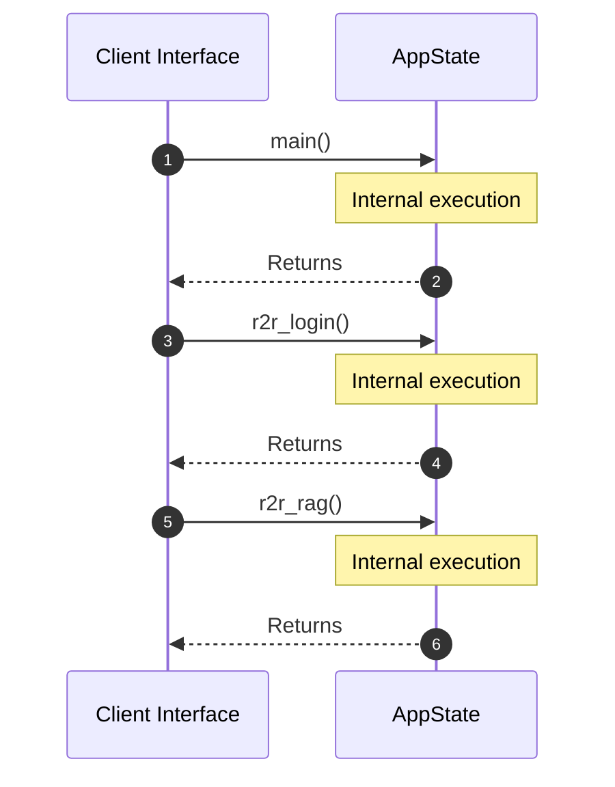

# Module Name: Mock_services

* **Source Directory Reference:** `src/bin/`
* **Package Dependency:**
- `axum::{`
- `serde::Deserialize`
- `serde_json::{json, Value}`
- `std::net::SocketAddr`
- `std::sync::Arc`
- `tracing_subscriber::{layer::SubscriberExt, util::SubscriberInitExt}`

## 1. Executive Summary & Purpose
Deterministic technical architecture for the `Mock_services` module extracted directly from the codebase.

## 2. UML 2.0 Class & Inheritance Architecture (Deterministic)
The following class diagram models the object-oriented structure, explicit inheritance hierarchies, and polymorphic interface implementations derived from local AST analysis:

## 3. Package & Class Relations

* **Inheritance & Polymorphism:** Diagram depicts detected traits, realizations, and abstractions.
* **Dependencies:** Defined by import structures across the boundary.

## 4. Execution Flow & Runtime Behavior

The following sequence diagram outlines the execution lifecycle and message passing during core operations:

---

* **Source Citations:**
* Class `AppState`: `src/bin/mock_services.rs:13`
* Class `JiraQueryParams`: `src/bin/mock_services.rs:77`
* Method `main`: `src/bin/mock_services.rs:16`
* Method `r2r_login`: `src/bin/mock_services.rs:40`
* Method `r2r_rag`: `src/bin/mock_services.rs:51`
* Method `r2r_search`: `src/bin/mock_services.rs:60`
* Method `jira_search`: `src/bin/mock_services.rs:81`
