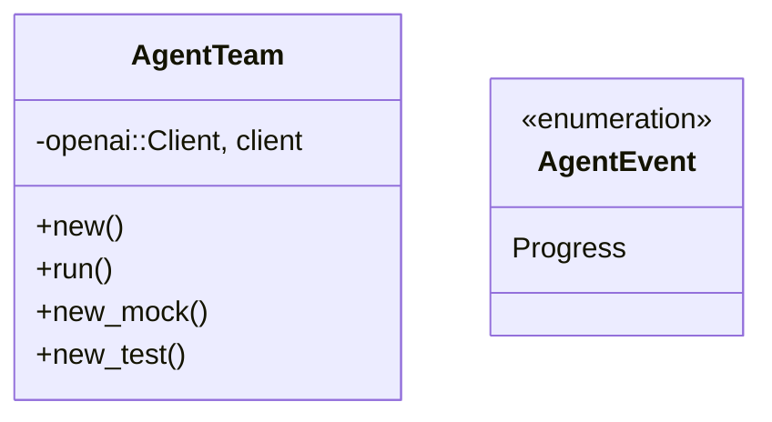
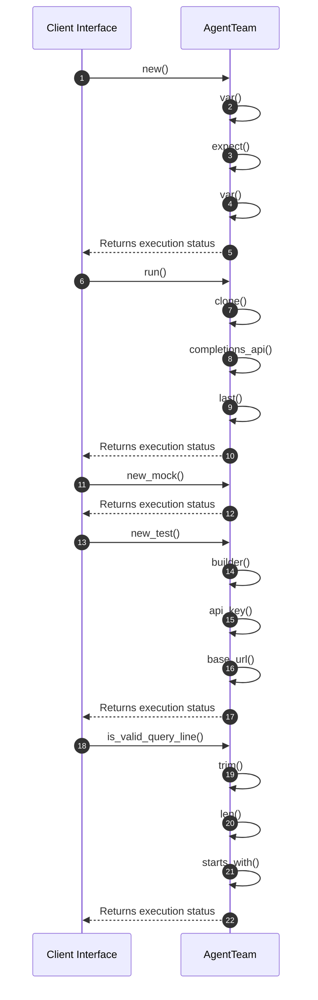

# Module Architecture: Team

* **Source File Reference:** `src/domain/agent/team.rs`
* **Package Dependencies:** Upstream: `[[stream]]` | `[[Input]]` | `[[ConfluenceTool]]` | `[[JiraTool]]` | `[[R2RTool]]` | `[[join_all, Stream, StreamExt}]]` | `[[MultiTurnStreamItem]]` | `[[CompletionClient]]` | `[[Prompt]]` | `[[openai]]` | `[[{StreamedAssistantContent, StreamingPrompt}]]` | `[[serde_json]]` | `[[env]]` | `[[Pin]]`

## 1. Executive Summary & Purpose
Deterministic technical architecture for the `Team` module extracted directly from the codebase.

## 2. UML 2.0 Diagrams

### Class / Struct Architecture

### Runtime Sequence Diagram

## 3. Data Structures, Structs & Class Properties

| Property / Field | Type | Visibility | Description | Source Reference |
| :--- | :--- | :--- | :--- | :--- |
| `client` | `openai::Client,` | Private (`-`) | Extracted property client. | `src/domain/agent/team.rs:51` |

## 4. Comprehensive Methods & Functions Breakdown

### Function / Method: `new()`
* **Source Reference:** `src/domain/agent/team.rs:55`
* **Visibility / Scope:** Public (`+`)
* **Behavioral Overview:** Extracted method logic.

#### Input Parameters
| Parameter | Type | Required / Default | Description |
| :--- | :--- | :--- | :--- |
| None | - | - | No parameters. |

#### Output & Return Values
| Return Type | Condition / Scenario | Description |
| :--- | :--- | :--- |
| `anyhow::Result<Self>` | Standard Execution | Derived return type. |

### Function / Method: `run(&self, input: Input)`
* **Source Reference:** `src/domain/agent/team.rs:66`
* **Visibility / Scope:** Public (`+`)
* **Behavioral Overview:** Extracted method logic.

#### Input Parameters
| Parameter | Type | Required / Default | Description |
| :--- | :--- | :--- | :--- |
| `self` | `instance reference` | Required | Context instance. |
| `input` | `Input` | Required | Derived parameter. |

#### Output & Return Values
| Return Type | Condition / Scenario | Description |
| :--- | :--- | :--- |
| `anyhow::Result<String>` | Standard Execution | Derived return type. |

### Function / Method: `new_mock()`
* **Source Reference:** `src/domain/agent/team.rs:454`
* **Visibility / Scope:** Public (`+`)
* **Behavioral Overview:** Extracted method logic.

#### Input Parameters
| Parameter | Type | Required / Default | Description |
| :--- | :--- | :--- | :--- |
| None | - | - | No parameters. |

#### Output & Return Values
| Return Type | Condition / Scenario | Description |
| :--- | :--- | :--- |
| `Self` | Standard Execution | Derived return type. |

### Function / Method: `new_test(base_url: &str)`
* **Source Reference:** `src/domain/agent/team.rs:463`
* **Visibility / Scope:** Public (`+`)
* **Behavioral Overview:** Extracted method logic.

#### Input Parameters
| Parameter | Type | Required / Default | Description |
| :--- | :--- | :--- | :--- |
| `base_url` | `&str` | Required | Derived parameter. |

#### Output & Return Values
| Return Type | Condition / Scenario | Description |
| :--- | :--- | :--- |
| `Self` | Standard Execution | Derived return type. |

### Function / Method: `is_valid_query_line(line: &str)`
* **Source Reference:** `src/domain/agent/team.rs:32`
* **Visibility / Scope:** Private (`-`)
* **Behavioral Overview:** Extracted method logic.

#### Input Parameters
| Parameter | Type | Required / Default | Description |
| :--- | :--- | :--- | :--- |
| `line` | `&str` | Required | Derived parameter. |

#### Output & Return Values
| Return Type | Condition / Scenario | Description |
| :--- | :--- | :--- |
| `bool` | Standard Execution | Derived return type. |

---

## 5. Source Code Citations & Index
* Module File: `src/domain/agent/team.rs`
* Class `AgentTeam`: `src/domain/agent/team.rs:51`
* Enum `AgentEvent`: `src/domain/agent/team.rs:23`
* Method `new`: `src/domain/agent/team.rs:55`
* Method `run`: `src/domain/agent/team.rs:66`
* Method `new_mock`: `src/domain/agent/team.rs:454`
* Method `new_test`: `src/domain/agent/team.rs:463`
* Method `is_valid_query_line`: `src/domain/agent/team.rs:32`
