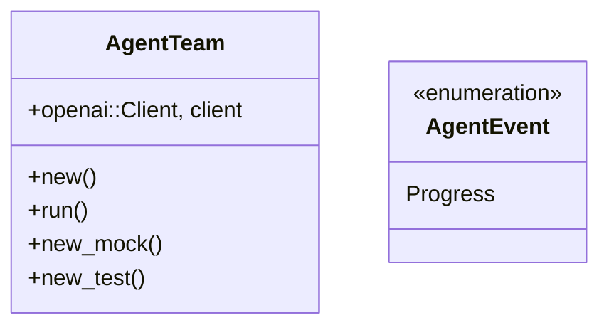
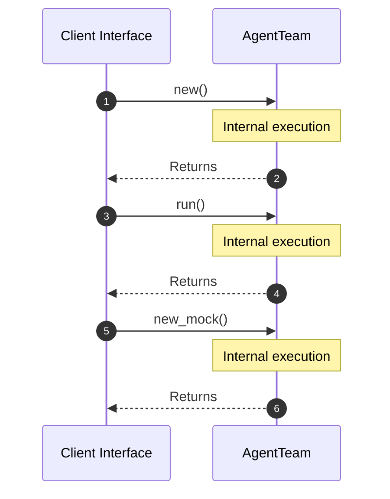

# Module Name: Team

* **Source Directory Reference:** `src/domain/agent/`
* **Package Dependency:**
- `async_stream::stream`
- `crate::application::dtos::Input`
- `crate::infrastructure::tools::confluence::ConfluenceTool`
- `crate::infrastructure::tools::jira::JiraTool`
- `crate::infrastructure::tools::r2r::R2RTool`
- `futures::{future::join_all, Stream, StreamExt}`
- `rig::agent::MultiTurnStreamItem`
- `rig::client::CompletionClient`
- `rig::completion::Prompt`
- `rig::providers::openai`
- `rig::streaming::{StreamedAssistantContent, StreamingPrompt}`
- `serde_json`
- `std::env`
- `std::pin::Pin`

## 1. Executive Summary & Purpose
Deterministic technical architecture for the `Team` module extracted directly from the codebase.

## 2. UML 2.0 Class & Inheritance Architecture (Deterministic)
The following class diagram models the object-oriented structure, explicit inheritance hierarchies, and polymorphic interface implementations derived from local AST analysis:

## 3. Package & Class Relations

* **Inheritance & Polymorphism:** Diagram depicts detected traits, realizations, and abstractions.
* **Dependencies:** Defined by import structures across the boundary.

## 4. Execution Flow & Runtime Behavior

The following sequence diagram outlines the execution lifecycle and message passing during core operations:

---

* **Source Citations:**
* Class `AgentTeam`: `src/domain/agent/team.rs:51`
* Class `AgentEvent`: `src/domain/agent/team.rs:23`
* Method `new` in `AgentTeam`: `src/domain/agent/team.rs:55`
* Method `run` in `AgentTeam`: `src/domain/agent/team.rs:66`
* Method `new_mock` in `AgentTeam`: `src/domain/agent/team.rs:454`
* Method `new_test` in `AgentTeam`: `src/domain/agent/team.rs:463`
* Method `is_valid_query_line`: `src/domain/agent/team.rs:32`
