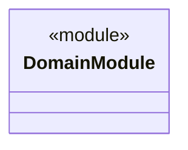
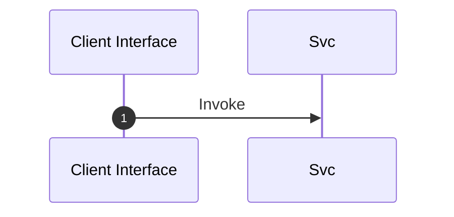

# Module Architecture: DomainModule

* **Source File Reference:** `src/domain/mod.rs`
* **Package Dependencies:** Upstream: None

## 1. Executive Summary & Purpose
Deterministic technical architecture for the `DomainModule` module extracted directly from the codebase.

## 2. UML 2.0 Diagrams

### Class / Struct Architecture

### Runtime Sequence Diagram

## 3. Data Structures, Structs & Class Properties

| Property / Field | Type | Visibility | Description | Source Reference |
| :--- | :--- | :--- | :--- | :--- |
| - | - | - | No properties extracted | - |

## 4. Comprehensive Methods & Functions Breakdown

No direct functions or methods extracted.

---

## 5. Source Code Citations & Index
* Module File: `src/domain/mod.rs`
* Class `DomainModule`: `src/domain/mod.rs:1`
