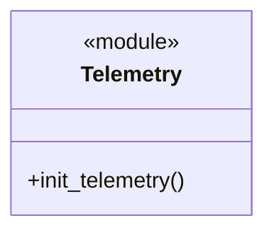
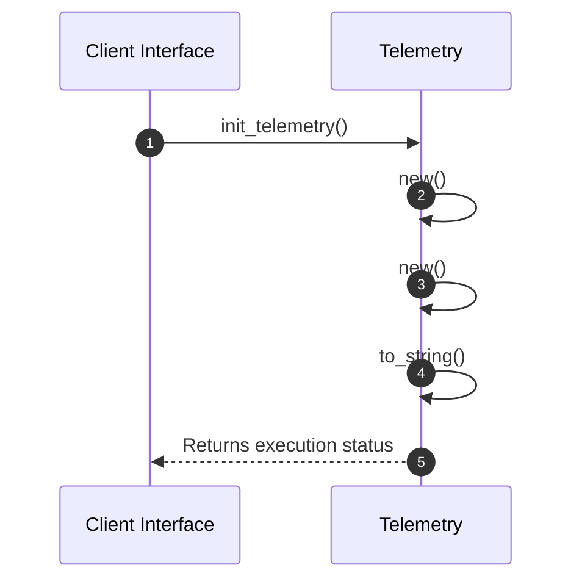

# Module Architecture: Telemetry

* **Source File Reference:** `src/infrastructure/telemetry.rs`
* **Package Dependencies:** Upstream: `[[KeyValue]]` | `[[WithExportConfig]]` | `[[Config, Resource}]]` | `[[SubscriberInitExt, EnvFilter}]]`

## 1. Executive Summary & Purpose
Deterministic technical architecture for the `Telemetry` module extracted directly from the codebase.

## 2. UML 2.0 Diagrams

### Class / Struct Architecture

### Runtime Sequence Diagram

## 3. Data Structures, Structs & Class Properties

| Property / Field | Type | Visibility | Description | Source Reference |
| :--- | :--- | :--- | :--- | :--- |
| - | - | - | No properties extracted | - |

## 4. Comprehensive Methods & Functions Breakdown

### Function / Method: `init_telemetry(app_name: &str, endpoint: &str)`
* **Source Reference:** `src/infrastructure/telemetry.rs:6`
* **Visibility / Scope:** Public (`+`)
* **Behavioral Overview:** Extracted method logic.

#### Input Parameters
| Parameter | Type | Required / Default | Description |
| :--- | :--- | :--- | :--- |
| `app_name` | `&str` | Required | Derived parameter. |
| `endpoint` | `&str` | Required | Derived parameter. |

#### Output & Return Values
| Return Type | Condition / Scenario | Description |
| :--- | :--- | :--- |
| `anyhow::Result<()>` | Standard Execution | Derived return type. |

---

## 5. Source Code Citations & Index
* Module File: `src/infrastructure/telemetry.rs`
* Class `Telemetry`: `src/infrastructure/telemetry.rs:1`
* Method `init_telemetry`: `src/infrastructure/telemetry.rs:6`
