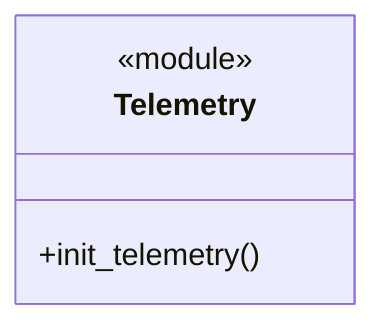
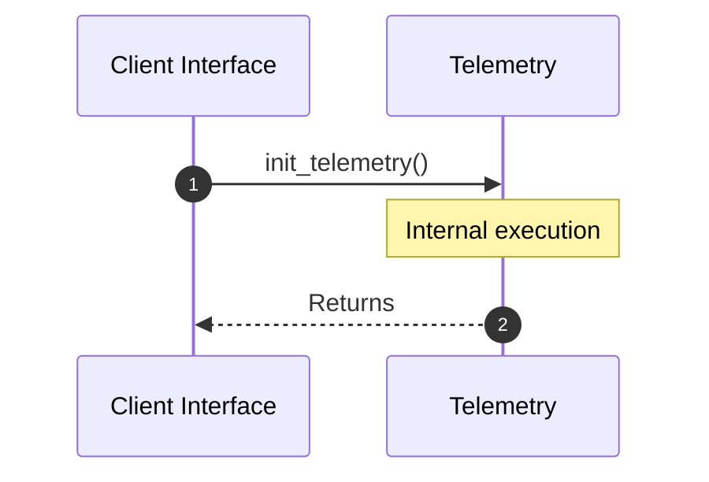

# Module Name: Telemetry

* **Source Directory Reference:** `src/infrastructure/`
* **Package Dependency:**
- `opentelemetry::KeyValue`
- `opentelemetry_otlp::WithExportConfig`
- `opentelemetry_sdk::{runtime, trace::Config, Resource}`
- `tracing_subscriber::{layer::SubscriberExt, util::SubscriberInitExt, EnvFilter}`

## 1. Executive Summary & Purpose
Deterministic technical architecture for the `Telemetry` module extracted directly from the codebase.

## 2. UML 2.0 Class & Inheritance Architecture (Deterministic)
The following class diagram models the object-oriented structure, explicit inheritance hierarchies, and polymorphic interface implementations derived from local AST analysis:

## 3. Package & Class Relations

* **Inheritance & Polymorphism:** Diagram depicts detected traits, realizations, and abstractions.
* **Dependencies:** Defined by import structures across the boundary.

## 4. Execution Flow & Runtime Behavior

The following sequence diagram outlines the execution lifecycle and message passing during core operations:

---

* **Source Citations:**
* Class `Telemetry`: `src/infrastructure/telemetry.rs:1`
* Method `init_telemetry`: `src/infrastructure/telemetry.rs:6`
