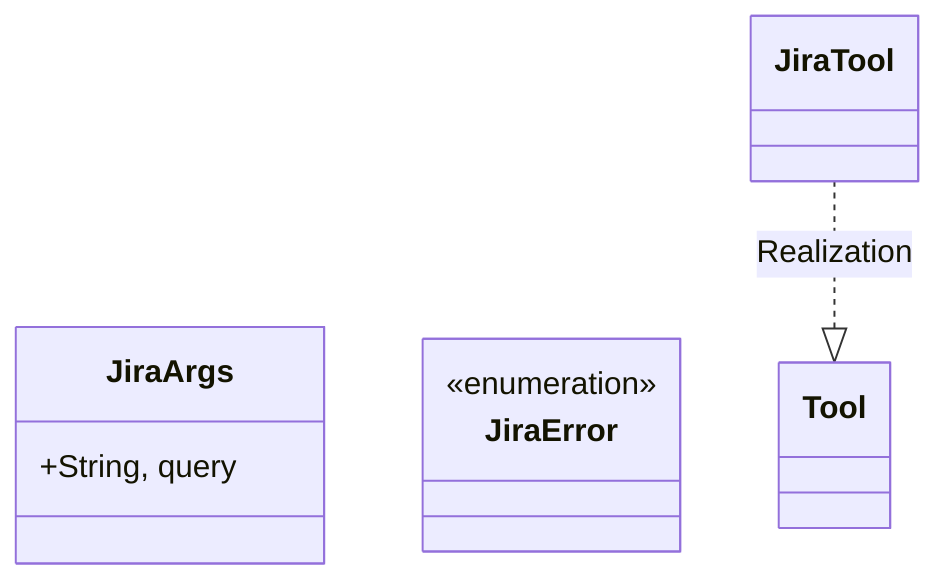
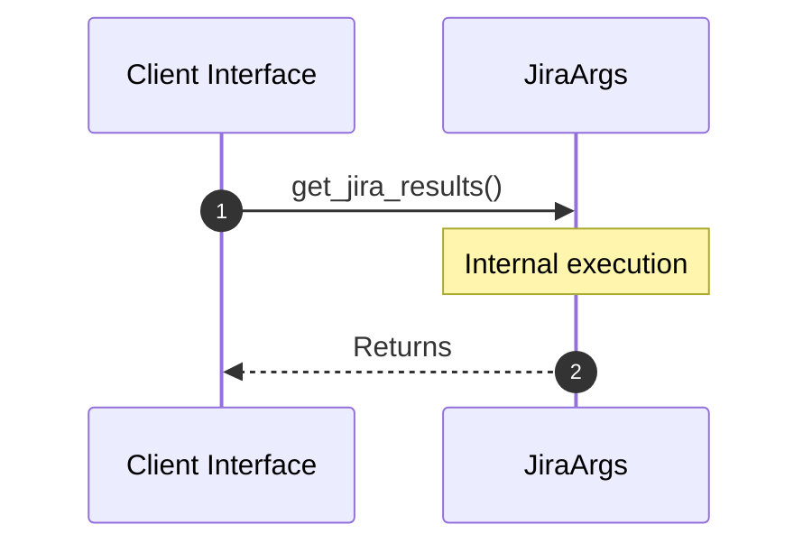

# Module Name: Jira

* **Source Directory Reference:** `src/infrastructure/tools/`
* **Package Dependency:**
- `rig::completion::ToolDefinition`
- `rig::tool::Tool`
- `serde::Deserialize`
- `serde_json::json`
- `std::env`
- `thiserror::Error`

## 1. Executive Summary & Purpose
Deterministic technical architecture for the `Jira` module extracted directly from the codebase.

## 2. UML 2.0 Class & Inheritance Architecture (Deterministic)
The following class diagram models the object-oriented structure, explicit inheritance hierarchies, and polymorphic interface implementations derived from local AST analysis:

## 3. Package & Class Relations

* **Inheritance & Polymorphism:** Diagram depicts detected traits, realizations, and abstractions.
* **Dependencies:** Defined by import structures across the boundary.

## 4. Execution Flow & Runtime Behavior

The following sequence diagram outlines the execution lifecycle and message passing during core operations:

---

* **Source Citations:**
* Class `JiraArgs`: `src/infrastructure/tools/jira.rs:9`
* Class `JiraError`: `src/infrastructure/tools/jira.rs:14`
* Method `definition` in `JiraTool`: `src/infrastructure/tools/jira.rs:29`
* Method `call` in `JiraTool`: `src/infrastructure/tools/jira.rs:44`
* Method `get_jira_results`: `src/infrastructure/tools/jira.rs:56`
