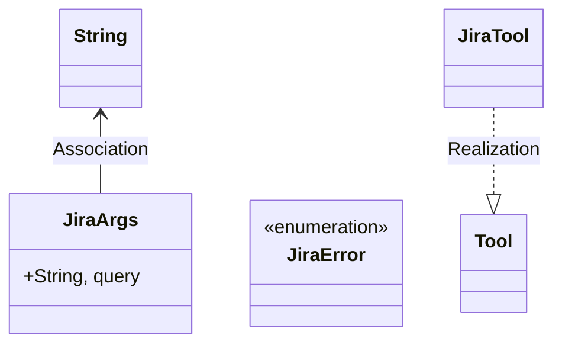
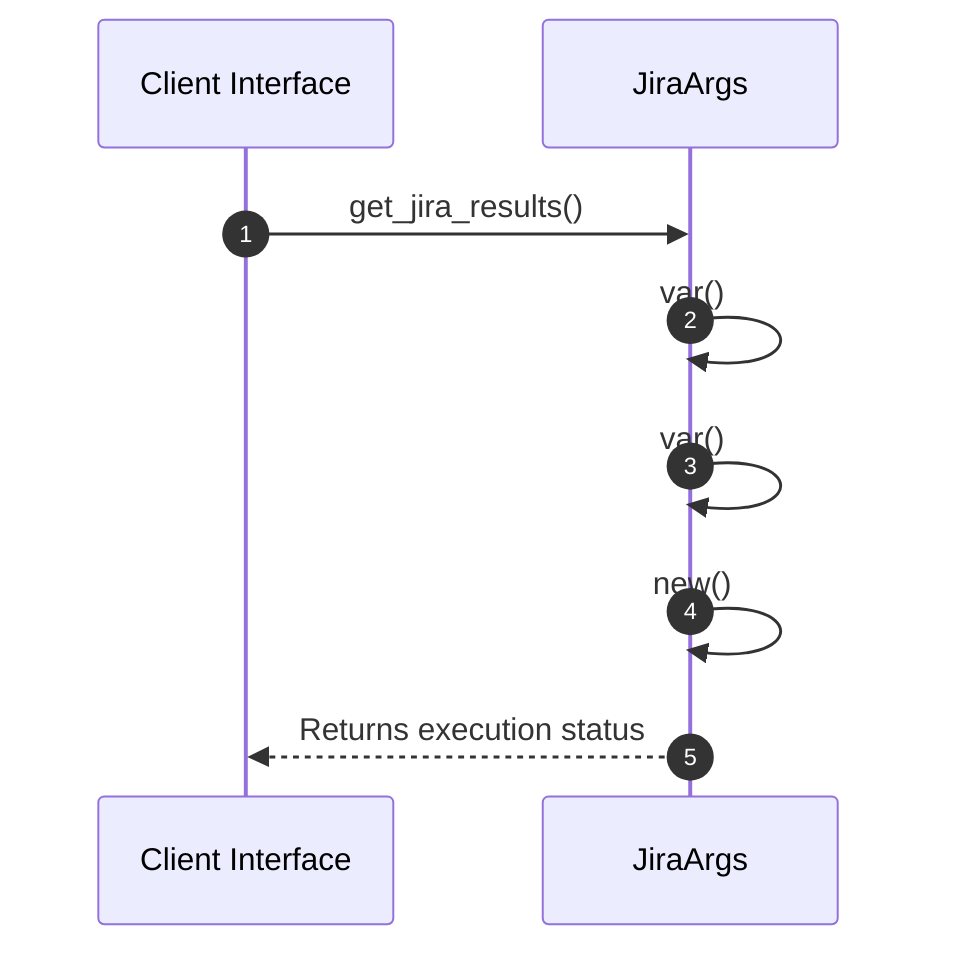

# Module Architecture: Jira

* **Source File Reference:** `src/infrastructure/tools/jira.rs`
* **Package Dependencies:** Upstream: `[[ToolDefinition]]` | `[[Tool]]` | `[[Deserialize]]` | `[[json]]` | `[[env]]` | `[[Error]]`

## 1. Executive Summary & Purpose
Deterministic technical architecture for the `Jira` module extracted directly from the codebase.

## 2. UML 2.0 Diagrams

### Class / Struct Architecture

### Runtime Sequence Diagram

## 3. Data Structures, Structs & Class Properties

| Property / Field | Type | Visibility | Description | Source Reference |
| :--- | :--- | :--- | :--- | :--- |
| `query` | `String,` | Public (`+`) | Extracted property query. | `src/infrastructure/tools/jira.rs:9` |

## 4. Comprehensive Methods & Functions Breakdown

### Function / Method: `get_jira_results(url: &str, query: &str)`
* **Source Reference:** `src/infrastructure/tools/jira.rs:56`
* **Visibility / Scope:** Public (`+`)
* **Behavioral Overview:** Extracted method logic.

#### Input Parameters
| Parameter | Type | Required / Default | Description |
| :--- | :--- | :--- | :--- |
| `url` | `&str` | Required | Derived parameter. |
| `query` | `&str` | Required | Derived parameter. |

#### Output & Return Values
| Return Type | Condition / Scenario | Description |
| :--- | :--- | :--- |
| `anyhow::Result<String>` | Standard Execution | Derived return type. |

---

## 5. Source Code Citations & Index
* Module File: `src/infrastructure/tools/jira.rs`
* Class `JiraArgs`: `src/infrastructure/tools/jira.rs:9`
* Enum `JiraError`: `src/infrastructure/tools/jira.rs:14`
* Method `get_jira_results`: `src/infrastructure/tools/jira.rs:56`
