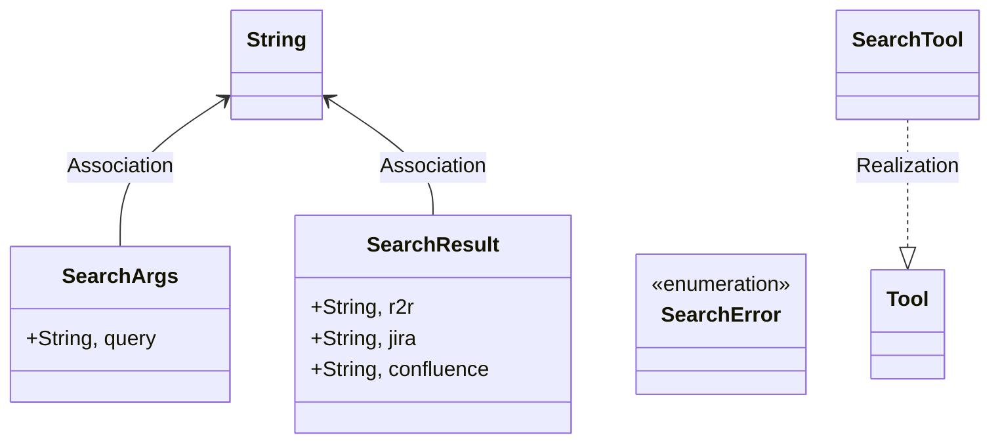
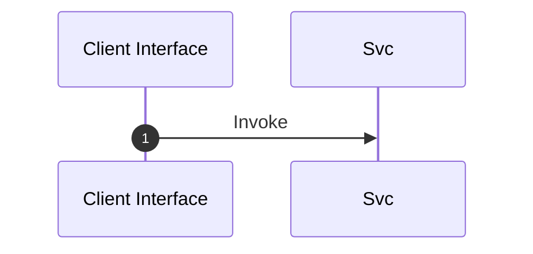

# Module Name: Search

* **Source Directory Reference:** `src/infrastructure/tools/`
* **Package Dependency:**
- `crate::infrastructure::tools::confluence::get_confluence_results`
- `crate::infrastructure::tools::jira::get_jira_results`
- `crate::infrastructure::tools::r2r::get_r2r_results`
- `rig::completion::ToolDefinition`
- `rig::tool::Tool`
- `serde::{Deserialize, Serialize}`
- `serde_json::json`
- `std::env`
- `thiserror::Error`

## 1. Executive Summary & Purpose
Deterministic technical architecture for the `Search` module extracted directly from the codebase.

## 2. UML 2.0 Class & Inheritance Architecture (Deterministic)
The following class diagram models the object-oriented structure, explicit inheritance hierarchies, and polymorphic interface implementations derived from local AST analysis:

## 3. Package & Class Relations

* **Inheritance & Polymorphism:** Detailed breakdown of abstract base classes, interfaces, and concrete overrides.
* **Dependencies:** How classes within this package collaborate externally.

## 4. Execution Flow & Runtime Behavior

The following sequence diagram outlines the execution lifecycle and message passing during core operations:

---

* **Source Citations:**
* Class `SearchArgs`: `src/infrastructure/tools/search.rs:12`
* Class `SearchResult`: `src/infrastructure/tools/search.rs:17`
* Class `SearchError`: `src/infrastructure/tools/search.rs:24`
