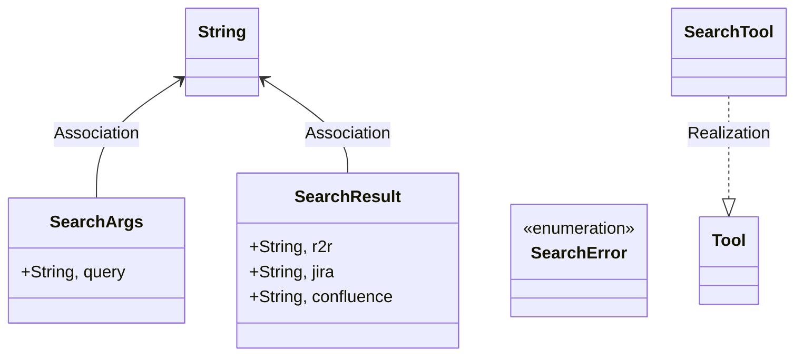
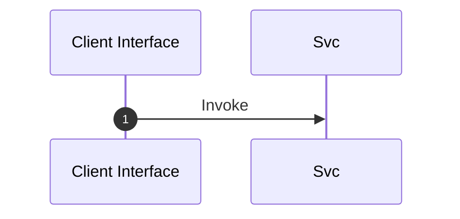

# Module Architecture: Search

* **Source File Reference:** `src/infrastructure/tools/search.rs`
* **Package Dependencies:** Upstream: `[[get_confluence_results]]` | `[[get_jira_results]]` | `[[get_r2r_results]]` | `[[ToolDefinition]]` | `[[Tool]]` | `[[{Deserialize, Serialize}]]` | `[[json]]` | `[[env]]` | `[[Error]]`

## 1. Executive Summary & Purpose
Deterministic technical architecture for the `Search` module extracted directly from the codebase.

## 2. UML 2.0 Diagrams

### Class / Struct Architecture

### Runtime Sequence Diagram

## 3. Data Structures, Structs & Class Properties

| Property / Field | Type | Visibility | Description | Source Reference |
| :--- | :--- | :--- | :--- | :--- |
| `query` | `String,` | Public (`+`) | Extracted property query. | `src/infrastructure/tools/search.rs:12` |
| `r2r` | `String,` | Public (`+`) | Extracted property r2r. | `src/infrastructure/tools/search.rs:17` |
| `jira` | `String,` | Public (`+`) | Extracted property jira. | `src/infrastructure/tools/search.rs:17` |
| `confluence` | `String,` | Public (`+`) | Extracted property confluence. | `src/infrastructure/tools/search.rs:17` |

## 4. Comprehensive Methods & Functions Breakdown

No direct functions or methods extracted.

---

## 5. Source Code Citations & Index
* Module File: `src/infrastructure/tools/search.rs`
* Class `SearchArgs`: `src/infrastructure/tools/search.rs:12`
* Class `SearchResult`: `src/infrastructure/tools/search.rs:17`
* Enum `SearchError`: `src/infrastructure/tools/search.rs:24`
