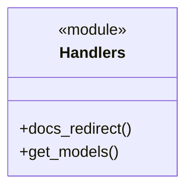
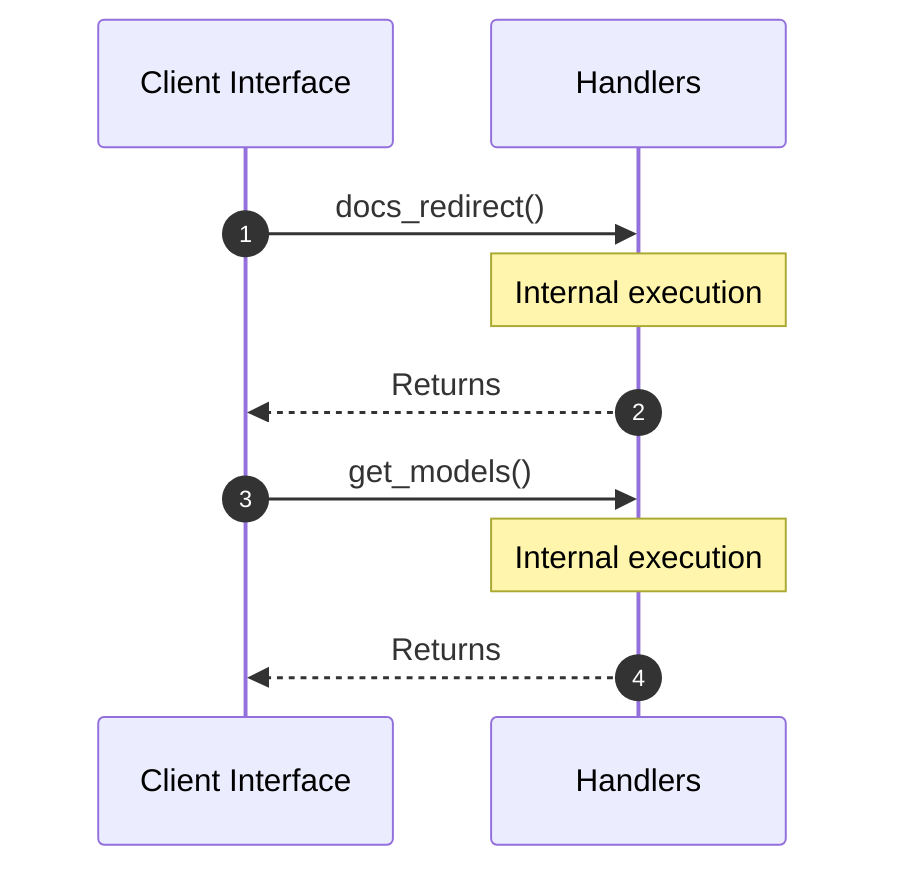

# Module Name: Handlers

* **Source Directory Reference:** `src/interface/http/`
* **Package Dependency:**
- `axum::{`
- `crate::application::dtos::Input`
- `crate::domain::agent::team::AgentEvent`
- `crate::interface::http::routes::AppState`
- `crate::interface::http::validation::ValidatedJson`
- `futures::StreamExt`
- `serde_json::json`
- `std::convert::Infallible`
- `std::sync::Arc`

## 1. Executive Summary & Purpose
Deterministic technical architecture for the `Handlers` module extracted directly from the codebase.

## 2. UML 2.0 Class & Inheritance Architecture (Deterministic)
The following class diagram models the object-oriented structure, explicit inheritance hierarchies, and polymorphic interface implementations derived from local AST analysis:

## 3. Package & Class Relations

* **Inheritance & Polymorphism:** Diagram depicts detected traits, realizations, and abstractions.
* **Dependencies:** Defined by import structures across the boundary.

## 4. Execution Flow & Runtime Behavior

The following sequence diagram outlines the execution lifecycle and message passing during core operations:

---

* **Source Citations:**
* Class `Handlers`: `src/interface/http/handlers.rs:1`
* Method `docs_redirect`: `src/interface/http/handlers.rs:17`
* Method `get_models`: `src/interface/http/handlers.rs:24`
