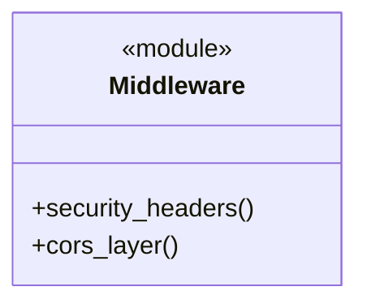
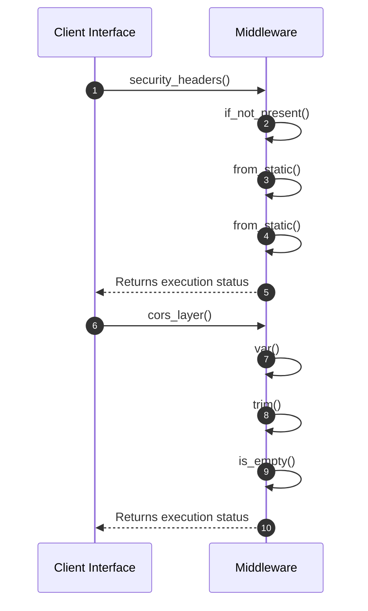

# Module Architecture: Middleware

* **Source File Reference:** `src/interface/http/middleware.rs`
* **Package Dependencies:** Upstream: `[[{HeaderName, HeaderValue}]]` | `[[env]]` | `[[{AllowOrigin, CorsLayer}]]` | `[[SetResponseHeaderLayer]]`

## 1. Executive Summary & Purpose
Deterministic technical architecture for the `Middleware` module extracted directly from the codebase.

## 2. UML 2.0 Diagrams

### Class / Struct Architecture

### Runtime Sequence Diagram

## 3. Data Structures, Structs & Class Properties

| Property / Field | Type | Visibility | Description | Source Reference |
| :--- | :--- | :--- | :--- | :--- |
| - | - | - | No properties extracted | - |

## 4. Comprehensive Methods & Functions Breakdown

### Function / Method: `security_headers()`
* **Source Reference:** `src/interface/http/middleware.rs:6`
* **Visibility / Scope:** Public (`+`)
* **Behavioral Overview:** Extracted method logic.

#### Input Parameters
| Parameter | Type | Required / Default | Description |
| :--- | :--- | :--- | :--- |
| None | - | - | No parameters. |

#### Output & Return Values
| Return Type | Condition / Scenario | Description |
| :--- | :--- | :--- |
| `Vec<SetResponseHeaderLayer<HeaderValue>>` | Standard Execution | Derived return type. |

### Function / Method: `cors_layer()`
* **Source Reference:** `src/interface/http/middleware.rs:33`
* **Visibility / Scope:** Public (`+`)
* **Behavioral Overview:** Extracted method logic.

#### Input Parameters
| Parameter | Type | Required / Default | Description |
| :--- | :--- | :--- | :--- |
| None | - | - | No parameters. |

#### Output & Return Values
| Return Type | Condition / Scenario | Description |
| :--- | :--- | :--- |
| `Option<CorsLayer>` | Standard Execution | Derived return type. |

---

## 5. Source Code Citations & Index
* Module File: `src/interface/http/middleware.rs`
* Class `Middleware`: `src/interface/http/middleware.rs:1`
* Method `security_headers`: `src/interface/http/middleware.rs:6`
* Method `cors_layer`: `src/interface/http/middleware.rs:33`
