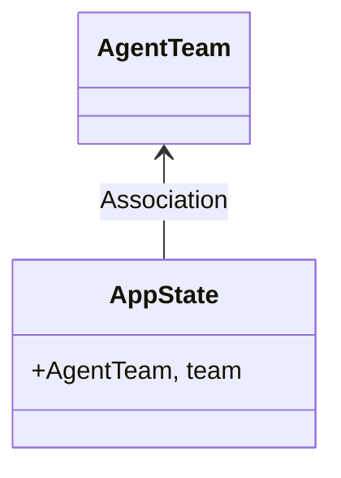
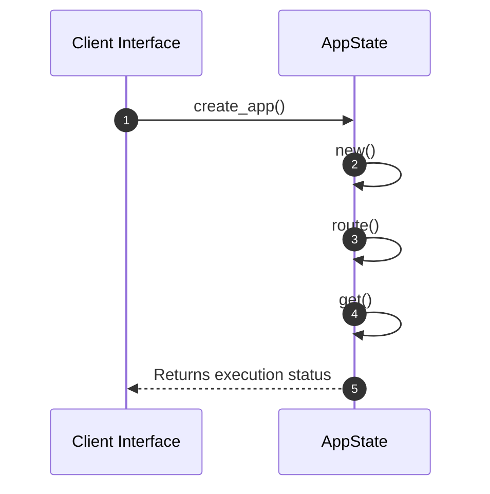

# Module Architecture: Routes

* **Source File Reference:** `src/interface/http/routes.rs`
* **Package Dependencies:** Upstream: `[[{]]` | `[[AgentTeam]]` | `[[{docs_redirect, get_models, route_query}]]` | `[[{cors_layer, security_headers}]]` | `[[Arc]]` | `[[TraceLayer]]`

## 1. Executive Summary & Purpose
Deterministic technical architecture for the `Routes` module extracted directly from the codebase.

## 2. UML 2.0 Diagrams

### Class / Struct Architecture

### Runtime Sequence Diagram

## 3. Data Structures, Structs & Class Properties

| Property / Field | Type | Visibility | Description | Source Reference |
| :--- | :--- | :--- | :--- | :--- |
| `team` | `AgentTeam,` | Public (`+`) | Extracted property team. | `src/interface/http/routes.rs:11` |

## 4. Comprehensive Methods & Functions Breakdown

### Function / Method: `create_app(state: Arc<AppState>)`
* **Source Reference:** `src/interface/http/routes.rs:15`
* **Visibility / Scope:** Public (`+`)
* **Behavioral Overview:** Extracted method logic.

#### Input Parameters
| Parameter | Type | Required / Default | Description |
| :--- | :--- | :--- | :--- |
| `state` | `Arc<AppState>` | Required | Derived parameter. |

#### Output & Return Values
| Return Type | Condition / Scenario | Description |
| :--- | :--- | :--- |
| `Router` | Standard Execution | Derived return type. |

---

## 5. Source Code Citations & Index
* Module File: `src/interface/http/routes.rs`
* Class `AppState`: `src/interface/http/routes.rs:11`
* Method `create_app`: `src/interface/http/routes.rs:15`
