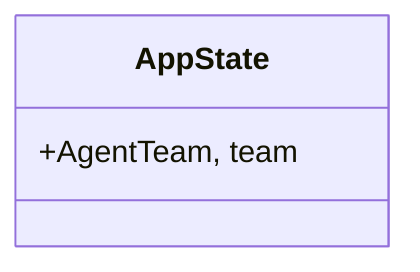
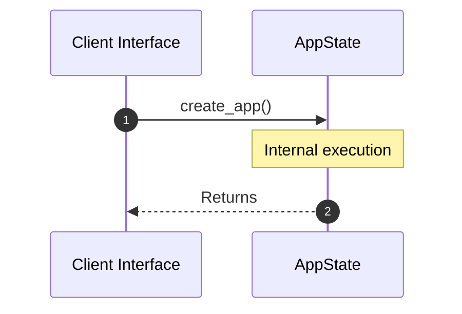

# Module Name: Routes

* **Source Directory Reference:** `src/interface/http/`
* **Package Dependency:**
- `axum::{`
- `crate::domain::agent::team::AgentTeam`
- `crate::interface::http::handlers::{docs_redirect, get_models, route_query}`
- `crate::interface::http::middleware::{cors_layer, security_headers}`
- `std::sync::Arc`
- `tower_http::trace::TraceLayer`

## 1. Executive Summary & Purpose
Deterministic technical architecture for the `Routes` module extracted directly from the codebase.

## 2. UML 2.0 Class & Inheritance Architecture (Deterministic)
The following class diagram models the object-oriented structure, explicit inheritance hierarchies, and polymorphic interface implementations derived from local AST analysis:

## 3. Package & Class Relations

* **Inheritance & Polymorphism:** Diagram depicts detected traits, realizations, and abstractions.
* **Dependencies:** Defined by import structures across the boundary.

## 4. Execution Flow & Runtime Behavior

The following sequence diagram outlines the execution lifecycle and message passing during core operations:

---

* **Source Citations:**
* Class `AppState`: `src/interface/http/routes.rs:11`
* Method `create_app`: `src/interface/http/routes.rs:15`
