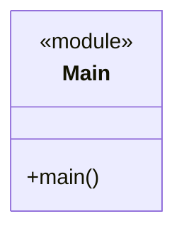
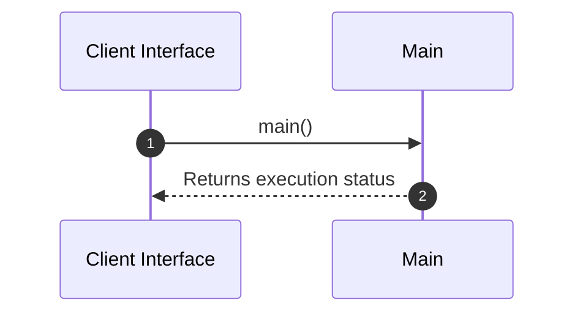

# Module Architecture: Main

* **Source File Reference:** `src/main.rs`
* **Package Dependencies:** Upstream: `[[dotenv]]` | `[[AgentTeam]]` | `[[telemetry]]` | `[[{create_app, AppState}]]` | `[[env]]` | `[[Arc]]`

## 1. Executive Summary & Purpose
Deterministic technical architecture for the `Main` module extracted directly from the codebase.

## 2. UML 2.0 Diagrams

### Class / Struct Architecture

### Runtime Sequence Diagram

## 3. Data Structures, Structs & Class Properties

| Property / Field | Type | Visibility | Description | Source Reference |
| :--- | :--- | :--- | :--- | :--- |
| - | - | - | No properties extracted | - |

## 4. Comprehensive Methods & Functions Breakdown

### Function / Method: `main()`
* **Source Reference:** `src/main.rs:9`
* **Visibility / Scope:** Private (`-`)
* **Behavioral Overview:** Extracted method logic.

#### Input Parameters
| Parameter | Type | Required / Default | Description |
| :--- | :--- | :--- | :--- |
| None | - | - | No parameters. |

#### Output & Return Values
| Return Type | Condition / Scenario | Description |
| :--- | :--- | :--- |
| `anyhow::Result<()>` | Standard Execution | Derived return type. |

---

## 5. Source Code Citations & Index
* Module File: `src/main.rs`
* Class `Main`: `src/main.rs:1`
* Method `main`: `src/main.rs:9`
