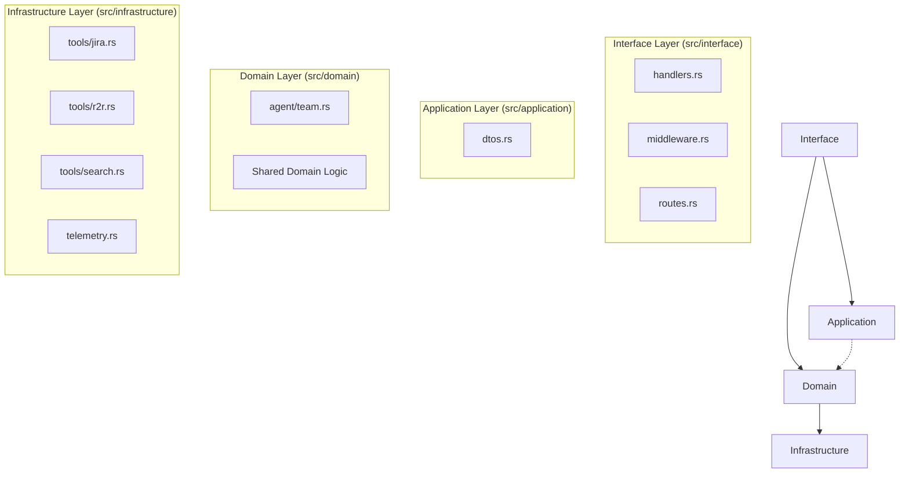

# Module Architecture (DDD)

The `fastapi-autogen-team` Rust service is architected using **Domain-Driven Design (DDD)** principles. This structure ensures that the core business logic (the "Domain") is isolated from external triggers (the "Interface") and external technical implementations (the "Infrastructure").

## 🏗️ DDD Layered Hierarchy

---

## 🛠️ Layer Responsibilities

### 1. Interface Layer (`src/interface`)
The entry point for all external requests. It is responsible for translating HTTP protocols into internal domain calls.
- **handlers.rs**: Axum route implementations for `/chat/completions` and `/models`.
- **middleware.rs**: Security hardening (CRLF injection prevention, CORS, HSTS).
- **routes.rs**: Defines the Router and the shared `AppState`.

### 2. Application Layer (`src/application`)
The "thin" layer that coordinates the execution of domain tasks and handles data transport formats.
- **dtos.rs**: Data Transfer Objects (Input/Output/Message/Choice) used for API communication.

### 3. Domain Layer (`src/domain`)
The core of the application. It contains the business rules and the `AgentTeam` orchestration logic. It is completely independent of the web framework.
- **agent/team.rs**: Implements the `AgentTeam` and its multi-agent orchestration (Planner + Searcher + QA).

### 4. Infrastructure Layer (`src/infrastructure`)
Contains technical implementations of domain requirements.
- **tools/**: Concrete tool logic for Jira JQL, R2R Vector Search, and the unified SearchTool.
- **telemetry.rs**: Integration with OpenTelemetry for tracing and logging.
