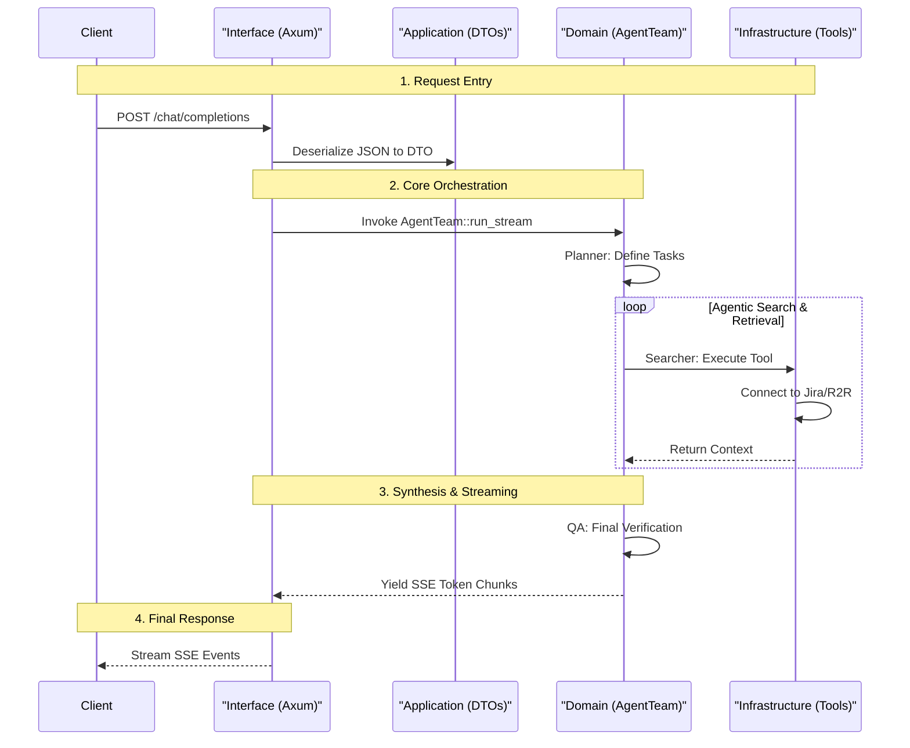

# Request Completion Sequence (DDD)

The following diagram illustrates the request lifecycle as it traverses the Domain-Driven Design (DDD) layers of the service. 

---

## 🔄 Interaction Lifecycle

---

## 🛠️ Key State Transitions
1. **Serialization**: `Interface` -> `Application` (Raw JSON to Typed DTO).
2. **Orchestration**: `Interface` -> `Domain` (HTTP Context to Business Logic).
3. **Retrieval**: `Domain` -> `Infrastructure` (Domain Query to Technical Client).
4. **Streaming**: `Domain` -> `Interface` (Logic Result to Web Protocol).
