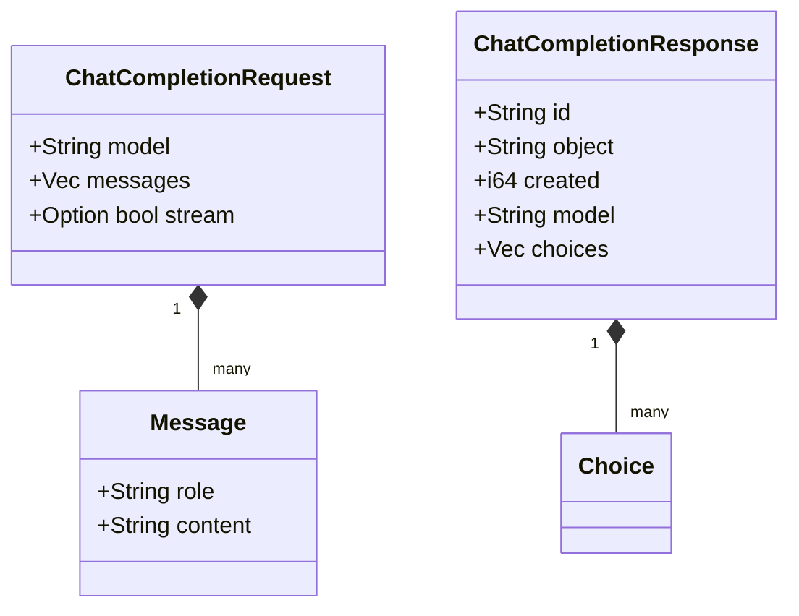

# Data Models (Application Layer)

All data transport models are centralized in the **Application Layer** to ensure consistent communication across the Interface, Domain, and Infrastructure.

---

## 🏗️ Core Models

The following structs are located in `src/application/dtos.rs` and are responsible for defining the OpenAI-compatible API contracts.

### [Input Models]
- **ChatCompletionRequest**: The main input structure for the `/chat/completions` endpoint.
- **Message**: Represents individual messages in the conversation (role/content).
- **ModelInformation**: Returned by the `/models` endpoint.

### [Output Models]
- **ChatCompletionResponse**: Used for non-streaming responses.
- **ChatCompletionChunk**: Used for streaming (SSE) responses.
- **Choice** / **ChoiceChunk**: Individual choices associated with completions.

---

## 📊 Data Mapping Example

---

## 🛠️ Validation Logic
Data validation (deserialization) occurs at the **Interface Layer** before passing these models to the **Domain Layer**. This ensures that the core orchestration only processes valid, well-formed entities.

The service uses **Serde** for high-performance JSON serialization and deserialization across all data transport objects.
