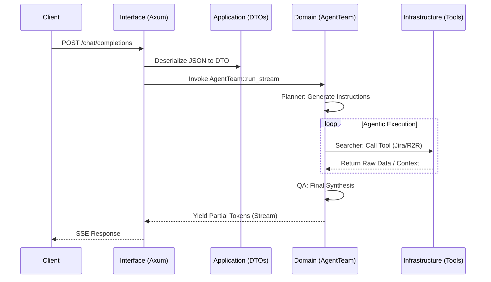

# V2 System Architecture (Rust DDD)

## 🏗️ High-Level Design (DDD)
The system has been architected using **Domain-Driven Design (DDD)** principles. This separation ensures that the core agentic orchestration remains decoupled from the web boundary and external technical details.

---

### [Interface Layer]
The entry point of the service is a REST API built with **Axum**, located in `src/interface/http/`.
- **routes.rs**: Centralized router configuration and shared `AppState`.
- **handlers.rs**: OpenAI-compatible route handlers implementing **Tokio streaming** for real-time SSE token delivery.
- **middleware.rs**: Layer for security (HSTS, CSP, X-Frame-Options) and CORS orchestration.

---

### [Application Layer]
The transport and orchestration layer, located in `src/application/`.
- **dtos.rs**: Serde-ready Data Transfer Objects that define the contract for all internal and external communication.

---

### [Domain Layer]
The core business logic and agent orchestration, located in `src/domain/agent/`.
- **team.rs**: Implements the `AgentTeam` using the **Rig** framework.
- **Orchestration Triad**:
    1.  **Planner**: Deconstructs user queries into actionable steps.
    2.  **Searcher**: Executes context-gathering tools.
    3.  **QA Agent**: Validates the reasoning and synthesizes the final response.

---

### [Infrastructure Layer]
Concrete implementations of external dependencies, located in `src/infrastructure/`.
- **tools/jira.rs**: Jira JQL client for issue tracking.
- **tools/r2r.rs**: Client for R2R vector retrieval.
- **tools/search.rs**: Unified SearchTool that provides a common interface for the agents.
- **telemetry.rs**: Instrumentation for OpenTelemetry (tracing, metrics, and logs).

---

## 🚦 Request Lifecycle through DDD Layers

---

## 🛠️ Module Structure (DDD)
- `src/interface/`: HTTP boundary and web server logic.
- `src/application/`: Data transport models.
- `src/domain/`: Core binary orchestration and agent flow.
- `src/infrastructure/`: External API interaction and telemetry.
- `src/main.rs`: Bootstraps the application.
- `src/lib.rs`: Exposes the core library to the binary.
